# Design Document: Digital Udhar Management System (Store Credit Management)

## 1. Overview

The Digital Udhar Management System (DUMS) is an enterprise-grade web application designed for shop owners to digitally manage customer credit (udhar), billing, product inventory, payments, and customer accounts. It replaces traditional paper-based ledger systems with a secure, real-time digital platform.

The system serves two primary user roles: **Store Owners** who manage their shop operations including credit issuance, payment tracking, product management, and reporting; and **Customers** who can view their credit balances, transaction history, and make payments.

Built on Next.js with Supabase as the backend, the system leverages PostgreSQL for robust relational data management, Row Level Security (RLS) for multi-tenant data isolation, and real-time subscriptions for live updates across the platform.

## 2. Architecture

### 2.1 System Context Diagram

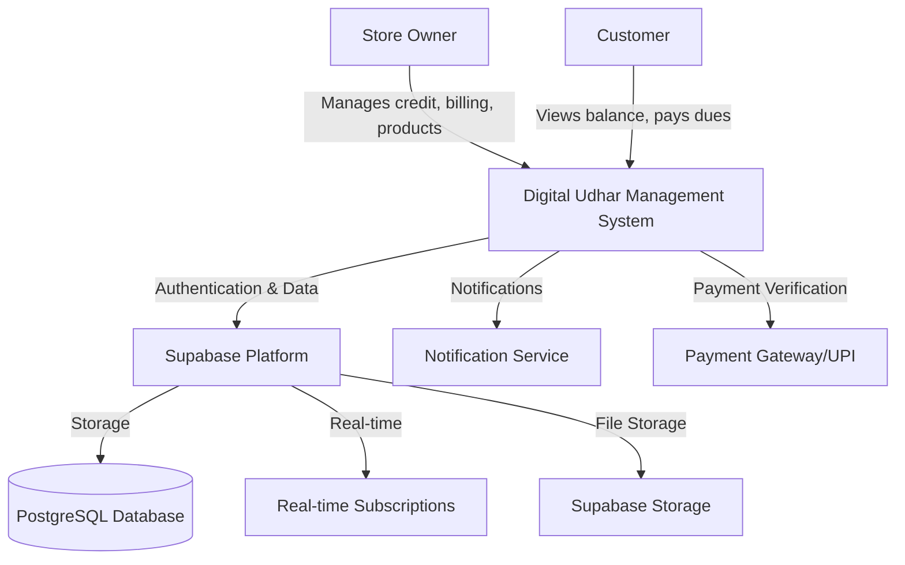
```mermaid
graph TD
    SO[Store Owner] -->|Manages credit, billing, products| DUMS[Digital Udhar Management System]
    C[Customer] -->|Views balance, pays dues| DUMS
    DUMS -->|Authentication & Data| SB[Supabase Platform]
    DUMS -->|Notifications| NS[Notification Service]
    DUMS -->|Payment Verification| PG[Payment Gateway/UPI]
    SB -->|Storage| PG_DB[(PostgreSQL Database)]
    SB -->|Real-time| RT[Real-time Subscriptions]
    SB -->|File Storage| FS[Supabase Storage]
```

### 2.2 High-Level Architecture

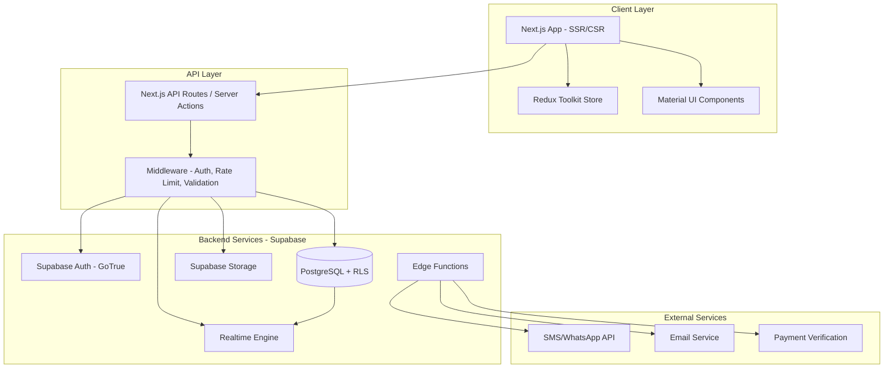
```mermaid
graph TB
    subgraph "Client Layer"
        NX[Next.js App - SSR/CSR]
        RD[Redux Toolkit Store]
        MUI[Material UI Components]
    end

    subgraph "API Layer"
        AR[Next.js API Routes / Server Actions]
        MW[Middleware - Auth, Rate Limit, Validation]
    end

    subgraph "Backend Services - Supabase"
        AUTH[Supabase Auth - GoTrue]
        DB[(PostgreSQL + RLS)]
        RT[Realtime Engine]
        STOR[Supabase Storage]
        EDGE[Edge Functions]
    end

    subgraph "External Services"
        SMS[SMS/WhatsApp API]
        EMAIL[Email Service]
        PAY[Payment Verification]
    end

    NX --> AR
    NX --> RD
    NX --> MUI
    AR --> MW
    MW --> AUTH
    MW --> DB
    MW --> RT
    MW --> STOR
    EDGE --> SMS
    EDGE --> EMAIL
    EDGE --> PAY
    DB --> RT
```

### 2.3 Deployment Architecture

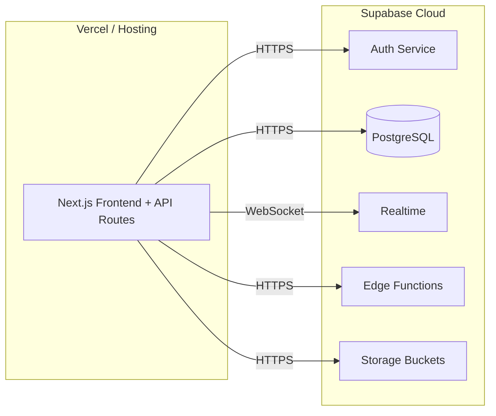
```mermaid
graph LR
    subgraph "Vercel / Hosting"
        FE[Next.js Frontend + API Routes]
    end

    subgraph "Supabase Cloud"
        SB_AUTH[Auth Service]
        SB_DB[(PostgreSQL)]
        SB_RT[Realtime]
        SB_EDGE[Edge Functions]
        SB_STOR[Storage Buckets]
    end

    FE -->|HTTPS| SB_AUTH
    FE -->|HTTPS| SB_DB
    FE -->|WebSocket| SB_RT
    FE -->|HTTPS| SB_EDGE
    FE -->|HTTPS| SB_STOR
```

## 3. Components and Interfaces

### 3.1 Billing Module (NEW)

**Purpose**: Complete billing lifecycle — create draft bills, add items, finalize, cancel, and generate invoice PDFs.

```typescript
interface BillingService {
  createBill(data: CreateBillInput): Promise<Bill>
  addBillItems(billId: string, items: BillItemInput[]): Promise<BillItem[]>
  updateBillItem(itemId: string, data: Partial<BillItemInput>): Promise<BillItem>
  removeBillItem(itemId: string): Promise<void>
  finalizeBill(billId: string): Promise<Bill>
  cancelBill(billId: string, reason: string): Promise<Bill>
  getBill(billId: string): Promise<BillWithItems>
  getBillsByStore(storeId: string, filters?: BillFilters): Promise<PaginatedResult<Bill>>
  getBillsByCustomer(customerId: string): Promise<PaginatedResult<Bill>>
  generateInvoicePDF(billId: string): Promise<string> // returns storage URL
  duplicateBill(billId: string): Promise<Bill>
}

interface Bill {
  id: string
  store_id: string
  customer_id: string
  bill_number: string          // auto-generated: INV-STORE-00001
  status: BillStatus
  subtotal: number
  discount_amount: number
  tax_amount: number
  total_amount: number
  due_date?: string
  notes?: string
  invoice_url?: string         // generated PDF URL
  created_by: string
  created_at: string
  updated_at: string
  finalized_at?: string
  cancelled_at?: string
  cancel_reason?: string
}

type BillStatus = 'draft' | 'finalized' | 'partially_paid' | 'paid' | 'overdue' | 'cancelled'

interface BillItem {
  id: string
  bill_id: string
  product_id?: string
  description: string
  quantity: number
  unit_price: number
  discount_percent: number
  discount_amount: number
  tax_percent: number
  tax_amount: number
  total_price: number
  sort_order: number
}

interface BillFilters {
  status?: BillStatus
  customer_id?: string
  date_from?: string
  date_to?: string
  min_amount?: number
  max_amount?: number
}
```

**Bill Status Flow**:
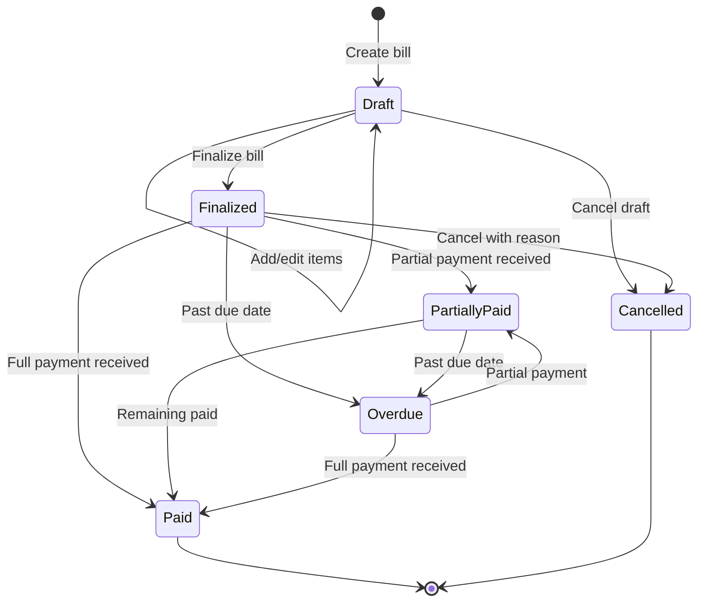
```mermaid
stateDiagram-v2
    [*] --> Draft: Create bill
    Draft --> Draft: Add/edit items
    Draft --> Finalized: Finalize bill
    Draft --> Cancelled: Cancel draft
    Finalized --> PartiallyPaid: Partial payment received
    Finalized --> Paid: Full payment received
    Finalized --> Overdue: Past due date
    Finalized --> Cancelled: Cancel with reason
    PartiallyPaid --> Paid: Remaining paid
    PartiallyPaid --> Overdue: Past due date
    Overdue --> Paid: Full payment received
    Overdue --> PartiallyPaid: Partial payment
    Paid --> [*]
    Cancelled --> [*]
```

### 3.2 EMI / Installment Management Module (NEW)

**Purpose**: Manage partial payments, installment schedules, and track remaining balances for large credit amounts.

```typescript
interface EMIService {
  createInstallmentPlan(data: CreateInstallmentPlanInput): Promise<InstallmentPlan>
  getInstallmentPlan(planId: string): Promise<InstallmentPlanWithSchedule>
  getInstallmentsByCustomer(customerId: string): Promise<InstallmentPlan[]>
  getInstallmentsByStore(storeId: string, filters?: EMIFilters): Promise<PaginatedResult<InstallmentPlan>>
  recordInstallmentPayment(scheduleId: string, amount: number, method: PaymentMethod): Promise<InstallmentPayment>
  getPaymentSchedule(planId: string): Promise<PaymentScheduleEntry[]>
  getOverdueInstallments(storeId: string): Promise<OverdueInstallment[]>
  restructurePlan(planId: string, newSchedule: RescheduleInput): Promise<InstallmentPlan>
  cancelPlan(planId: string, reason: string): Promise<void>
}

interface InstallmentPlan {
  id: string
  store_id: string
  customer_id: string
  bill_id?: string             // linked to a bill
  total_amount: number
  down_payment: number
  remaining_amount: number
  total_paid: number
  number_of_installments: number
  installment_amount: number   // per installment
  frequency: 'weekly' | 'biweekly' | 'monthly'
  start_date: string
  end_date: string
  status: InstallmentPlanStatus
  created_at: string
  updated_at: string
}

type InstallmentPlanStatus = 'active' | 'completed' | 'overdue' | 'defaulted' | 'cancelled'

interface PaymentScheduleEntry {
  id: string
  plan_id: string
  installment_number: number
  due_date: string
  amount_due: number
  amount_paid: number
  remaining: number
  status: 'pending' | 'paid' | 'partial' | 'overdue' | 'skipped'
  paid_at?: string
  payment_method?: PaymentMethod
}

interface OverdueInstallment {
  plan_id: string
  customer_id: string
  customer_name: string
  installment_number: number
  due_date: string
  amount_due: number
  days_overdue: number
}
```

### 3.3 Payment Configuration Module (NEW)

**Purpose**: Store owner configures their payment acceptance methods — QR codes, UPI IDs, and bank account details displayed to customers.

```typescript
interface PaymentConfigService {
  getPaymentConfig(storeId: string): Promise<PaymentConfig>
  updatePaymentConfig(storeId: string, data: UpdatePaymentConfigInput): Promise<PaymentConfig>
  uploadQRCode(storeId: string, file: File): Promise<string> // returns storage URL
  deleteQRCode(storeId: string): Promise<void>
  getActivePaymentMethods(storeId: string): Promise<ActivePaymentMethod[]>
}

interface PaymentConfig {
  id: string
  store_id: string
  upi_id?: string
  upi_display_name?: string
  qr_code_url?: string
  bank_name?: string
  bank_account_number?: string
  bank_ifsc_code?: string
  bank_account_holder?: string
  accepted_methods: PaymentMethod[]
  is_cash_enabled: boolean
  is_upi_enabled: boolean
  is_bank_transfer_enabled: boolean
  updated_at: string
}

interface ActivePaymentMethod {
  method: PaymentMethod
  label: string
  details: Record<string, string>  // display info for customer
  qr_url?: string
}
```

### 3.4 Authentication Module (UPDATED)

**Purpose**: Manages user registration, login, session management, role-based access, and customer invitation flow.

```typescript
interface AuthService {
  signUp(email: string, password: string, role: UserRole): Promise<AuthResponse>
  signIn(email: string, password: string): Promise<AuthResponse>
  signOut(): Promise<void>
  resetPassword(email: string): Promise<void>
  getSession(): Promise<Session | null>
  getUserRole(userId: string): Promise<UserRole>
  verifyPhone(phone: string, otp: string): Promise<boolean>
  // NEW: Customer invitation flow
  inviteCustomer(storeId: string, data: InviteCustomerInput): Promise<CustomerInvitation>
  acceptInvitation(token: string): Promise<AuthResponse>
  resendInvitation(invitationId: string): Promise<void>
  forcePasswordChange(userId: string): Promise<void>
}

interface CustomerInvitation {
  id: string
  store_id: string
  customer_id: string
  phone: string
  email?: string
  invitation_token: string
  auto_generated_password: string  // temporary, must change on first login
  status: 'pending' | 'accepted' | 'expired'
  sent_via: 'sms' | 'email' | 'whatsapp'
  expires_at: string
  created_at: string
  accepted_at?: string
}

// Customer Registration Flow:
// 1. Store owner adds customer → system generates invitation
// 2. Auto-credentials generated (temp password)
// 3. Invitation sent via SMS/WhatsApp/Email with login link
// 4. Customer clicks link → auto-login with temp credentials
// 5. Force password change on first login
// 6. Customer account linked to customer record
```

**Responsibilities**:
- User registration with role assignment
- Phone/email-based authentication
- Session lifecycle management
- OTP verification for phone-based login
- Password reset flows
- Customer invitation and auto-credential generation
- First login password change enforcement

### 3.5 Store Management Module

**Purpose**: Manages user registration, login, session management, and role-based access.

```typescript
interface AuthService {
  signUp(email: string, password: string, role: UserRole): Promise<AuthResponse>
  signIn(email: string, password: string): Promise<AuthResponse>
  signOut(): Promise<void>
  resetPassword(email: string): Promise<void>
  getSession(): Promise<Session | null>
  getUserRole(userId: string): Promise<UserRole>
  verifyPhone(phone: string, otp: string): Promise<boolean>
}

type UserRole = 'store_owner' | 'customer'

interface AuthResponse {
  user: User | null
  session: Session | null
  error: AuthError | null
}
```

**Responsibilities**:
- User registration with role assignment
- Phone/email-based authentication
- Session lifecycle management
- OTP verification for phone-based login
- Password reset flows

### 3.2 Store Management Module

**Purpose**: Handles store profile creation, settings, and multi-store support.

```typescript
interface StoreService {
  createStore(data: CreateStoreInput): Promise<Store>
  updateStore(storeId: string, data: UpdateStoreInput): Promise<Store>
  getStore(storeId: string): Promise<Store>
  getStoresByOwner(ownerId: string): Promise<Store[]>
  deactivateStore(storeId: string): Promise<void>
  getStoreSettings(storeId: string): Promise<StoreSettings>
  updateStoreSettings(storeId: string, settings: Partial<StoreSettings>): Promise<StoreSettings>
}

interface Store {
  id: string
  owner_id: string
  name: string
  address: string
  phone: string
  gstin?: string
  logo_url?: string
  settings: StoreSettings
  created_at: string
  updated_at: string
  is_active: boolean
}

interface StoreSettings {
  currency: string
  credit_limit_default: number
  payment_reminder_days: number
  auto_reminder_enabled: boolean
  notification_channels: NotificationChannel[]
}
```

### 3.3 Customer Management Module

**Purpose**: Manages customer profiles, credit limits, and relationships with stores.

```typescript
interface CustomerService {
  addCustomer(storeId: string, data: CreateCustomerInput): Promise<Customer>
  updateCustomer(customerId: string, data: UpdateCustomerInput): Promise<Customer>
  getCustomer(customerId: string): Promise<CustomerWithBalance>
  getCustomersByStore(storeId: string, filters?: CustomerFilters): Promise<PaginatedResult<CustomerWithBalance>>
  setCustomerCreditLimit(customerId: string, limit: number): Promise<void>
  deactivateCustomer(customerId: string): Promise<void>
  getCustomerLedger(customerId: string, dateRange?: DateRange): Promise<LedgerEntry[]>
  linkCustomerToUser(customerId: string, userId: string): Promise<void>
}

interface Customer {
  id: string
  store_id: string
  linked_user_id?: string
  name: string
  phone: string
  email?: string
  address?: string
  credit_limit: number
  current_balance: number
  trust_score: number
  is_active: boolean
  created_at: string
  updated_at: string
}

interface CustomerWithBalance extends Customer {
  total_credit: number
  total_paid: number
  outstanding_balance: number
  last_transaction_date: string
  overdue_amount: number
}
```

### 3.7 Product, Profit & Inventory Module (UPDATED)

**Purpose**: Manages product catalog, pricing with profit tracking, stock levels, purchase entries, and full inventory management.

```typescript
interface ProductService {
  createProduct(storeId: string, data: CreateProductInput): Promise<Product>
  updateProduct(productId: string, data: UpdateProductInput): Promise<Product>
  getProduct(productId: string): Promise<ProductWithProfit>
  getProductsByStore(storeId: string, filters?: ProductFilters): Promise<PaginatedResult<ProductWithProfit>>
  updateStock(productId: string, quantity: number, type: StockUpdateType): Promise<void>
  getProductCategories(storeId: string): Promise<Category[]>
  bulkImportProducts(storeId: string, products: CreateProductInput[]): Promise<BulkImportResult>
  // NEW: Inventory management
  recordPurchaseEntry(data: PurchaseEntryInput): Promise<PurchaseEntry>
  recordStockOut(data: StockOutInput): Promise<StockMovement>
  getStockMovements(productId: string, dateRange?: DateRange): Promise<StockMovement[]>
  getInventorySummary(storeId: string): Promise<InventorySummary>
  getPurchaseHistory(storeId: string, filters?: PurchaseFilters): Promise<PaginatedResult<PurchaseEntry>>
  getProfitReport(storeId: string, dateRange: DateRange): Promise<ProfitReport>
}

interface Product {
  id: string
  store_id: string
  name: string
  description?: string
  sku?: string
  category_id?: string
  purchase_price: number       // NEW: cost price
  selling_price: number        // renamed from unit_price
  discount_percent: number     // NEW: default discount
  discount_amount: number      // NEW: computed discount
  effective_price: number      // NEW: selling_price - discount
  profit_amount: number        // NEW: effective_price - purchase_price
  profit_margin_percent: number // NEW: (profit / purchase_price) * 100
  unit: string
  stock_quantity: number
  low_stock_threshold: number
  is_active: boolean
  created_at: string
  updated_at: string
}

interface ProductWithProfit extends Product {
  total_units_sold: number
  total_revenue: number
  total_profit: number
  avg_margin: number
}

// NEW: Inventory Management
interface PurchaseEntry {
  id: string
  store_id: string
  product_id: string
  supplier_name?: string
  quantity: number
  purchase_price_per_unit: number
  total_cost: number
  invoice_number?: string
  purchase_date: string
  notes?: string
  created_by: string
  created_at: string
}

interface StockMovement {
  id: string
  store_id: string
  product_id: string
  type: 'stock_in' | 'stock_out' | 'adjustment' | 'purchase'
  quantity: number
  reference_type?: 'purchase_entry' | 'bill' | 'manual' | 'return'
  reference_id?: string
  stock_before: number
  stock_after: number
  notes?: string
  created_by: string
  created_at: string
}

interface InventorySummary {
  total_products: number
  total_stock_value: number       // at purchase price
  total_selling_value: number     // at selling price
  potential_profit: number
  low_stock_count: number
  out_of_stock_count: number
  categories_breakdown: CategoryStock[]
}

interface ProfitReport {
  period: DateRange
  total_revenue: number
  total_cost: number
  gross_profit: number
  gross_margin_percent: number
  products: ProductProfitEntry[]
  daily_breakdown: DailyProfit[]
}

type StockUpdateType = 'add' | 'subtract' | 'set'
```

### 3.5 Credit & Transaction Module (DEPRECATED — REMOVED)

> **Architecture Cleanup Decision**: The `transactions` and `transaction_items` tables have been **removed** from the data model.
>
> **Rationale**: With the introduction of Bills, BillItems, Payments, LedgerEntries, and InstallmentPlans, the generic Transaction/TransactionItems tables are redundant. Every financial event is now tracked through its purpose-specific table:
>
> | Old (Transactions) | New (Purpose-Specific) |
> |---|---|
> | type: 'credit' | `bills` → `ledger_entries` (type: credit) |
> | type: 'payment' | `payments` → `ledger_entries` (type: debit) |
> | type: 'refund' | `payments` (negative) → `ledger_entries` (type: credit) |
> | type: 'adjustment' | `ledger_entries` (type: credit/debit, ref: adjustment) |
> | transaction_items | `bill_items` |
> | balance_after | `ledger_entries.balance_after` |
> | reference_number | `bills.bill_number` |
>
> **Single Financial Source of Truth**:
> - `ledger_entries` is the ONLY source of truth for customer balance
> - `customer.current_balance` is a **cached/denormalized** value updated via trigger
> - To verify integrity: `customer.current_balance == latest ledger_entry.balance_after`
>
> **Customer Balance Strategy**:
> ```
> Source of Truth: ledger_entries (append-only, immutable)
> Cached Value:    customer.current_balance (denormalized for read performance)
> Sync Mechanism:  PostgreSQL trigger on ledger_entries INSERT → updates customer.current_balance
> Reconciliation:  fn_reconcile_ledger() can verify cache == source at any time
> ```

### 3.6 Payment Module (UPDATED)

**Purpose**: Handles payment recording, verification, and reconciliation. Proof/verification data lives directly in the payments table (no separate PaymentVerification table needed).

```typescript
interface PaymentService {
  recordPayment(data: RecordPaymentInput): Promise<Payment>
  verifyPayment(paymentId: string): Promise<PaymentVerificationResult>
  getPaymentHistory(customerId: string, filters?: PaymentFilters): Promise<PaginatedResult<Payment>>
  getPaymentsByStore(storeId: string, filters?: PaymentFilters): Promise<PaginatedResult<Payment>>
  markPaymentDisputed(paymentId: string, reason: string): Promise<void>
  resolveDispute(paymentId: string, resolution: DisputeResolution): Promise<void>
}

interface Payment {
  id: string
  store_id: string
  customer_id: string
  bill_id?: string                // which bill this pays (optional)
  installment_schedule_id?: string // which installment this pays (optional)
  amount: number
  method: PaymentMethod
  status: PaymentStatus
  reference_id?: string           // UPI ref, bank transfer ref, cheque no
  proof_url?: string              // screenshot/photo stored in Supabase Storage
  verified_at?: string
  verified_by?: string            // store owner who verified
  rejection_reason?: string       // if rejected
  notes?: string
  created_at: string
  updated_at: string
}

type PaymentMethod = 'cash' | 'upi' | 'bank_transfer' | 'cheque' | 'other'
type PaymentStatus = 'pending' | 'verified' | 'rejected' | 'disputed'
```

> **Design Decision — No Separate PaymentVerification Table**:
> The `proof_url`, `reference_id`, `verified_at`, `verified_by`, and `rejection_reason` fields live directly in the `payments` table. A separate table would add a 1:1 join with no benefit since every payment has exactly one verification outcome. The `audit_logs` table captures the full verification history (who, when, what changed).

### 3.7 Notification Module

**Purpose**: Manages all system notifications including payment reminders, due alerts, and transaction confirmations.

```typescript
interface NotificationService {
  sendNotification(data: SendNotificationInput): Promise<NotificationResult>
  scheduleReminder(data: ScheduleReminderInput): Promise<ScheduledReminder>
  getNotificationHistory(userId: string): Promise<Notification[]>
  markAsRead(notificationId: string): Promise<void>
  updatePreferences(userId: string, prefs: NotificationPreferences): Promise<void>
  cancelScheduledReminder(reminderId: string): Promise<void>
}

interface Notification {
  id: string
  user_id: string
  type: NotificationType
  channel: NotificationChannel
  title: string
  body: string
  data?: Record<string, unknown>
  is_read: boolean
  sent_at: string
  read_at?: string
}

type NotificationType = 'payment_reminder' | 'payment_received' | 'credit_issued' | 'overdue_alert' | 'low_stock' | 'report_ready' | 'bill_generated' | 'installment_due' | 'invitation_sent'
type NotificationChannel = 'in_app' | 'sms' | 'whatsapp' | 'email' | 'push'

// NEW: Notification Configuration
interface NotificationConfigService {
  getNotificationConfig(storeId: string): Promise<NotificationConfig>
  updateNotificationConfig(storeId: string, config: Partial<NotificationConfig>): Promise<NotificationConfig>
  testNotificationChannel(storeId: string, channel: NotificationChannel): Promise<boolean>
}

interface NotificationConfig {
  id: string
  store_id: string
  email_enabled: boolean
  email_provider: 'resend' | 'sendgrid' | null
  email_from_name?: string
  email_from_address?: string
  push_enabled: boolean
  push_vapid_public_key?: string
  whatsapp_enabled: boolean           // future
  whatsapp_business_phone?: string    // future
  sms_enabled: boolean
  sms_provider?: 'twilio' | 'msg91'
  quiet_hours_start: string           // e.g. "21:00"
  quiet_hours_end: string             // e.g. "09:00"
  default_channels: NotificationChannel[]
  updated_at: string
}
```

### 3.8 Reporting Module

**Purpose**: Generates business intelligence reports and analytics for store owners.

```typescript
interface ReportingService {
  getDashboardSummary(storeId: string): Promise<DashboardSummary>
  getCreditReport(storeId: string, dateRange: DateRange): Promise<CreditReport>
  getPaymentReport(storeId: string, dateRange: DateRange): Promise<PaymentReport>
  getCustomerReport(storeId: string): Promise<CustomerReport>
  getProductReport(storeId: string, dateRange: DateRange): Promise<ProductReport>
  exportReport(reportType: ReportType, format: ExportFormat): Promise<string>
  getOverdueReport(storeId: string): Promise<OverdueReport>
  // NEW: Scheduled Reports
  createScheduledReport(data: CreateScheduledReportInput): Promise<ScheduledReport>
  getScheduledReports(storeId: string): Promise<ScheduledReport[]>
  updateScheduledReport(reportId: string, data: Partial<ScheduledReport>): Promise<ScheduledReport>
  deleteScheduledReport(reportId: string): Promise<void>
  // NEW: Profit Report
  getProfitLossReport(storeId: string, dateRange: DateRange): Promise<ProfitLossReport>
}

interface DashboardSummary {
  total_customers: number
  active_customers: number
  total_outstanding: number
  total_collected_today: number
  total_credit_today: number
  overdue_count: number
  overdue_amount: number
  monthly_trend: MonthlyTrend[]
  top_debtors: CustomerWithBalance[]
  recent_transactions: Transaction[]
}

type ReportType = 'credit' | 'payment' | 'customer' | 'product' | 'overdue' | 'profit_loss' | 'inventory' | 'emi'
type ExportFormat = 'pdf' | 'csv' | 'excel'

// NEW: Scheduled Reports
interface ScheduledReport {
  id: string
  store_id: string
  report_type: ReportType
  frequency: 'weekly' | 'monthly'
  delivery_channel: 'email'
  recipient_emails: string[]
  format: ExportFormat
  day_of_week?: number          // 0-6 for weekly (0=Sunday)
  day_of_month?: number         // 1-28 for monthly
  time_of_day: string           // "08:00" UTC
  is_active: boolean
  last_sent_at?: string
  next_send_at: string
  created_at: string
}

// Edge Function: pg_cron triggers weekly (Sunday 8AM) and monthly (1st 8AM)
// Generates reports, exports to PDF/Excel, emails to configured recipients
```


### 3.12 Audit Logs Module (NEW)

**Purpose**: Tracks all sensitive operations across the system for accountability, compliance, and debugging.

```typescript
interface AuditLogService {
  logAction(data: AuditLogInput): Promise<void>
  getAuditLogs(storeId: string, filters?: AuditLogFilters): Promise<PaginatedResult<AuditLog>>
  getEntityHistory(entityType: string, entityId: string): Promise<AuditLog[]>
  getUserActions(userId: string, dateRange?: DateRange): Promise<AuditLog[]>
  exportAuditLogs(storeId: string, dateRange: DateRange): Promise<string>
}

interface AuditLog {
  id: string
  store_id: string
  user_id: string
  user_role: UserRole
  action: AuditAction
  entity_type: AuditEntityType
  entity_id: string
  changes?: {
    before: Record<string, unknown>
    after: Record<string, unknown>
  }
  metadata?: Record<string, unknown>
  ip_address?: string
  user_agent?: string
  created_at: string
}

type AuditAction = 
  | 'create' | 'update' | 'delete' | 'void'
  | 'verify_payment' | 'reject_payment'
  | 'login' | 'logout' | 'password_change'
  | 'invite_customer' | 'change_credit_limit'
  | 'generate_bill' | 'cancel_bill'
  | 'export_report' | 'settings_change'

type AuditEntityType = 
  | 'customer' | 'transaction' | 'payment' | 'bill'
  | 'product' | 'store' | 'user' | 'installment_plan'
  | 'notification_config' | 'payment_config' | 'ledger_entry'

interface AuditLogFilters {
  user_id?: string
  action?: AuditAction
  entity_type?: AuditEntityType
  date_from?: string
  date_to?: string
}

// Implementation: PostgreSQL trigger-based automatic logging
// All INSERT/UPDATE/DELETE on sensitive tables auto-log via DB triggers
// Application-level logging for business actions (verify, reject, void)
```

### 3.14 Customer Ledger Module (NEW)

**Purpose**: Maintains a complete double-entry style ledger for each customer showing all credit (debit to customer) and payment (credit to customer) entries with running balance.

```typescript
interface LedgerService {
  getLedger(customerId: string, filters?: LedgerFilters): Promise<PaginatedResult<LedgerEntry>>
  getLedgerSummary(customerId: string): Promise<LedgerSummary>
  createLedgerEntry(data: CreateLedgerEntryInput): Promise<LedgerEntry>  // internal use only
  getRunningBalance(customerId: string, asOfDate?: string): Promise<number>
  exportLedger(customerId: string, dateRange: DateRange, format: ExportFormat): Promise<string>
  reconcileLedger(customerId: string): Promise<ReconciliationResult>
}

interface LedgerEntry {
  id: string
  store_id: string
  customer_id: string
  entry_type: LedgerEntryType
  reference_type: LedgerReferenceType
  reference_id: string            // bill_id, payment_id, etc.
  description: string
  debit_amount: number            // credit given to customer (increases outstanding)
  credit_amount: number           // payment received (decreases outstanding)
  balance_before: number          // running balance before this entry
  balance_after: number           // running balance after this entry
  entry_date: string
  created_at: string
}

type LedgerEntryType = 'credit' | 'debit'
// credit = customer receives goods/service (outstanding increases)
// debit = customer pays (outstanding decreases)

type LedgerReferenceType = 'bill' | 'payment' | 'refund' | 'adjustment' | 'opening_balance'

interface LedgerSummary {
  customer_id: string
  total_credits: number           // total billed
  total_debits: number            // total paid
  current_balance: number         // outstanding
  first_entry_date: string
  last_entry_date: string
  total_entries: number
}

interface LedgerFilters {
  entry_type?: LedgerEntryType
  date_from?: string
  date_to?: string
  reference_type?: LedgerReferenceType
  min_amount?: number
  max_amount?: number
}

interface ReconciliationResult {
  is_consistent: boolean
  calculated_balance: number
  stored_balance: number
  discrepancy?: number
  last_consistent_entry_id?: string
}
```

**Ledger Entry Rules**:
- Entries are IMMUTABLE — never updated or deleted
- Every financial event creates exactly one ledger entry
- `balance_after = balance_before + debit_amount - credit_amount`
- Running balance must always match `customer.current_balance`

### 3.15 Due Reminder Rules Module (NEW)

**Purpose**: Configurable rules engine for automatic payment reminders based on due dates and overdue status.

```typescript
interface DueReminderRuleService {
  getRules(storeId: string): Promise<DueReminderRule[]>
  createRule(data: CreateReminderRuleInput): Promise<DueReminderRule>
  updateRule(ruleId: string, data: Partial<DueReminderRule>): Promise<DueReminderRule>
  deleteRule(ruleId: string): Promise<void>
  getActiveRemindersForCustomer(customerId: string): Promise<ActiveReminder[]>
  processRules(storeId: string): Promise<RuleProcessingResult>  // called by cron
}

interface DueReminderRule {
  id: string
  store_id: string
  name: string
  trigger_type: ReminderTriggerType
  days_offset: number              // days before/after due date
  repeat_frequency?: RepeatFrequency
  repeat_max_count?: number        // max times to repeat (null = unlimited until paid)
  channels: NotificationChannel[]
  message_template: string
  is_active: boolean
  priority: number                 // lower = higher priority
  created_at: string
  updated_at: string
}

type ReminderTriggerType = 'before_due' | 'on_due_date' | 'after_overdue'
type RepeatFrequency = 'daily' | 'every_3_days' | 'weekly' | 'biweekly'

interface ActiveReminder {
  id: string
  rule_id: string
  customer_id: string
  bill_id?: string
  installment_schedule_id?: string
  due_date: string
  next_send_at: string
  sent_count: number
  last_sent_at?: string
  status: 'scheduled' | 'sent' | 'completed' | 'cancelled'
}

interface RuleProcessingResult {
  rules_evaluated: number
  reminders_sent: number
  reminders_skipped: number        // quiet hours, max count reached
  errors: number
}

// Default Store Rules (auto-created on store setup):
// 1. "3 Days Before Due" - trigger_type: before_due, days_offset: 3, repeat: once
// 2. "On Due Date" - trigger_type: on_due_date, days_offset: 0, repeat: once
// 3. "Overdue Daily" - trigger_type: after_overdue, days_offset: 1, repeat: daily, max: 7
// 4. "Overdue Weekly" - trigger_type: after_overdue, days_offset: 7, repeat: weekly, max: 4
```

### 3.16 Owner Dashboard Metrics Module (NEW)

**Purpose**: Real-time dashboard metrics and KPIs for store owners.

```typescript
interface OwnerDashboardService {
  getMetrics(storeId: string): Promise<OwnerDashboardMetrics>
  getMetricHistory(storeId: string, metric: MetricType, period: 'week' | 'month' | 'year'): Promise<MetricHistory[]>
}

interface OwnerDashboardMetrics {
  // Financial
  total_outstanding: number              // SUM of all customer balances
  total_outstanding_change: number       // % change from last period
  todays_collection: number              // payments verified today
  todays_credit_issued: number           // credit given today
  monthly_collection: number             // this month's total payments
  monthly_collection_target?: number     // if set by owner
  total_profit: number                   // this month's gross profit (from product margins)
  profit_margin_avg: number              // average profit margin %
  
  // Operational
  pending_payment_verifications: number  // payments awaiting approval
  pending_verifications_amount: number   // total amount pending
  low_stock_products_count: number       // products below threshold
  out_of_stock_count: number             // products at zero stock
  overdue_customers_count: number        // customers past due date
  overdue_total_amount: number           // total overdue amount
  
  // Engagement
  active_customers: number               // transacted in last 30 days
  total_customers: number
  new_customers_this_month: number
  pending_invitations: number
  
  // EMI
  active_installment_plans: number
  overdue_installments_count: number
  upcoming_installments_this_week: number
  
  // Computed
  collection_efficiency: number          // (collected / due) * 100
  avg_payment_delay_days: number
  top_debtors: TopDebtor[]               // top 5 by outstanding
}

interface TopDebtor {
  customer_id: string
  customer_name: string
  outstanding: number
  overdue_days: number
  last_payment_date?: string
}

type MetricType = 'outstanding' | 'collection' | 'credit_issued' | 'profit' | 'customers'

interface MetricHistory {
  date: string
  value: number
}
```

### 3.17 Central Configuration Module (NEW)

**Purpose**: Unified configuration panel for store owners — consolidates shop info, SMTP, payment, notification, and report schedule config in one place.

```typescript
interface CentralConfigService {
  getFullConfig(storeId: string): Promise<CentralConfig>
  updateShopInfo(storeId: string, data: ShopInfoInput): Promise<ShopInfo>
  updateSMTPConfig(storeId: string, data: SMTPConfigInput): Promise<SMTPConfig>
  testSMTPConnection(storeId: string): Promise<{ success: boolean; error?: string }>
  // Payment config, notification config, and report schedule config
  // are accessed via their individual modules but displayed in this central UI
}

interface CentralConfig {
  shop_info: ShopInfo
  smtp_config: SMTPConfig
  payment_config: PaymentConfig       // from PaymentConfigService
  notification_config: NotificationConfig  // from NotificationConfigService
  report_schedules: ScheduledReport[]  // from ReportingService
  reminder_rules: DueReminderRule[]    // from DueReminderRuleService
}

interface ShopInfo {
  store_id: string
  name: string
  address: string
  city: string
  state: string
  pincode: string
  phone: string
  email: string
  gstin?: string
  logo_url?: string
  tagline?: string
  footer_text?: string             // shown on invoices
  currency: string
  timezone: string
}

interface SMTPConfig {
  id: string
  store_id: string
  provider: 'custom' | 'resend' | 'sendgrid'
  host?: string                    // for custom SMTP
  port?: number
  username?: string
  password_encrypted?: string      // encrypted at rest
  from_name: string
  from_email: string
  api_key_encrypted?: string       // for Resend/SendGrid
  is_verified: boolean
  last_test_at?: string
  last_test_result?: boolean
  updated_at: string
}

// Central Config UI Pages:
// /store/settings/shop-info
// /store/settings/smtp
// /store/settings/payments        → PaymentConfig
// /store/settings/notifications   → NotificationConfig
// /store/settings/reports         → ScheduledReports
// /store/settings/reminders       → DueReminderRules
```

### 3.13 Customer Dashboard Module (NEW)

**Purpose**: Provides customers with a self-service portal to view their balances, transaction history, bills, installment schedules, and make payments.

```typescript
interface CustomerDashboardService {
  getCustomerOverview(userId: string): Promise<CustomerDashboardData>
  getMyStores(): Promise<LinkedStore[]>           // stores where customer has credit
  getMyBalance(storeId: string): Promise<BalanceSummary>
  getMyTransactions(storeId: string, filters?: TransactionFilters): Promise<PaginatedResult<Transaction>>
  getMyBills(storeId: string, filters?: BillFilters): Promise<PaginatedResult<Bill>>
  getMyInstallments(storeId: string): Promise<InstallmentPlan[]>
  getUpcomingDues(): Promise<UpcomingDue[]>
  getPaymentMethods(storeId: string): Promise<ActivePaymentMethod[]>  // store's accepted methods
  submitPayment(storeId: string, data: CustomerPaymentInput): Promise<Payment>
}

interface CustomerDashboardData {
  total_stores_linked: number
  total_outstanding: number        // across all stores
  upcoming_dues_count: number
  upcoming_dues_amount: number
  stores: LinkedStoreBalance[]
  recent_activity: CustomerActivity[]
}

interface LinkedStoreBalance {
  store_id: string
  store_name: string
  store_phone: string
  outstanding_balance: number
  next_due_date?: string
  next_due_amount?: number
  active_installments: number
}

interface UpcomingDue {
  store_id: string
  store_name: string
  type: 'bill' | 'installment'
  reference_id: string
  amount: number
  due_date: string
  days_until_due: number
}

interface CustomerActivity {
  type: 'credit_issued' | 'payment_verified' | 'bill_generated' | 'installment_due'
  description: string
  amount: number
  store_name: string
  created_at: string
}
```

**Customer Dashboard Pages**:
- `/customer/dashboard` — Overview with all linked stores and balances
- `/customer/store/:storeId` — Detailed view for a specific store
- `/customer/bills` — All bills across stores
- `/customer/payments` — Payment history and new payment form
- `/customer/installments` — Active installment plans and schedule
- `/customer/profile` — Profile management and password change


## 4. Data Models

### 4.1 Entity Relationship Diagram (FINAL — Post-Cleanup)


```mermaid
erDiagram
    USERS ||--o{ STORES : owns
    USERS ||--o{ CUSTOMERS : "linked_as"
    STORES ||--o{ CUSTOMERS : has
    STORES ||--o{ PRODUCTS : sells
    STORES ||--o{ CATEGORIES : defines
    CUSTOMERS ||--o{ PAYMENTS : makes
    STORES ||--o{ PAYMENTS : receives
    BILLS ||--o{ PAYMENTS : "paid_by"
    USERS ||--o{ NOTIFICATIONS : receives
    STORES ||--o{ SCHEDULED_REMINDERS : configures
    CUSTOMERS ||--o{ SCHEDULED_REMINDERS : targets
    STORES ||--o{ BILLS : issues
    CUSTOMERS ||--o{ BILLS : receives
    BILLS ||--o{ BILL_ITEMS : contains
    PRODUCTS ||--o{ BILL_ITEMS : referenced_in
    CUSTOMERS ||--o{ INSTALLMENT_PLANS : has
    BILLS ||--o{ INSTALLMENT_PLANS : "paid_via_emi"
    INSTALLMENT_PLANS ||--o{ PAYMENT_SCHEDULE : contains
    STORES ||--|| PAYMENT_CONFIG : configures
    STORES ||--|| NOTIFICATION_CONFIG : configures
    STORES ||--|| SMTP_CONFIG : configures
    STORES ||--o{ CUSTOMER_INVITATIONS : sends
    STORES ||--o{ AUDIT_LOGS : records
    PRODUCTS ||--o{ PURCHASE_ENTRIES : purchased_via
    PRODUCTS ||--o{ STOCK_MOVEMENTS : tracked_in
    STORES ||--o{ SCHEDULED_REPORTS : configures
    STORES ||--o{ LEDGER_ENTRIES : records
    CUSTOMERS ||--o{ LEDGER_ENTRIES : has
    STORES ||--o{ DUE_REMINDER_RULES : configures
    DUE_REMINDER_RULES ||--o{ ACTIVE_REMINDERS : generates
    CUSTOMERS ||--o{ ACTIVE_REMINDERS : targets

    USERS {
        uuid id PK
        string email
        string phone
        string full_name
        enum role
        boolean is_active
        boolean must_change_password
        timestamp created_at
    }

    STORES {
        uuid id PK
        uuid owner_id FK
        string name
        string address
        string phone
        string gstin
        string logo_url
        jsonb settings
        boolean is_active
        timestamp created_at
    }

    CUSTOMERS {
        uuid id PK
        uuid store_id FK
        uuid linked_user_id FK
        string name
        string phone
        string email
        string address
        decimal credit_limit
        decimal current_balance
        integer trust_score
        enum invitation_status
        boolean is_active
        timestamp created_at
    }

    PRODUCTS {
        uuid id PK
        uuid store_id FK
        uuid category_id FK
        string name
        string sku
        string description
        decimal purchase_price
        decimal selling_price
        decimal discount_percent
        string unit
        integer stock_quantity
        integer low_stock_threshold
        boolean is_active
        timestamp created_at
    }

    BILLS {
        uuid id PK
        uuid store_id FK
        uuid customer_id FK
        string bill_number
        enum status
        decimal subtotal
        decimal discount_amount
        decimal tax_amount
        decimal total_amount
        string due_date
        string invoice_url
        uuid created_by
        timestamp created_at
        timestamp finalized_at
        timestamp cancelled_at
    }

    BILL_ITEMS {
        uuid id PK
        uuid bill_id FK
        uuid product_id FK
        string description
        decimal quantity
        decimal unit_price
        decimal discount_percent
        decimal discount_amount
        decimal tax_percent
        decimal tax_amount
        decimal total_price
        integer sort_order
    }

    INSTALLMENT_PLANS {
        uuid id PK
        uuid store_id FK
        uuid customer_id FK
        uuid bill_id FK
        decimal total_amount
        decimal down_payment
        decimal remaining_amount
        decimal total_paid
        integer number_of_installments
        decimal installment_amount
        enum frequency
        string start_date
        string end_date
        enum status
        timestamp created_at
    }

    PAYMENT_SCHEDULE {
        uuid id PK
        uuid plan_id FK
        integer installment_number
        string due_date
        decimal amount_due
        decimal amount_paid
        decimal remaining
        enum status
        timestamp paid_at
        enum payment_method
    }

    PAYMENT_CONFIG {
        uuid id PK
        uuid store_id FK
        string upi_id
        string upi_display_name
        string qr_code_url
        string bank_name
        string bank_account_number
        string bank_ifsc_code
        string bank_account_holder
        jsonb accepted_methods
        boolean is_cash_enabled
        boolean is_upi_enabled
        boolean is_bank_transfer_enabled
        timestamp updated_at
    }

    NOTIFICATION_CONFIG {
        uuid id PK
        uuid store_id FK
        boolean email_enabled
        string email_provider
        boolean push_enabled
        boolean whatsapp_enabled
        boolean sms_enabled
        string quiet_hours_start
        string quiet_hours_end
        jsonb default_channels
        timestamp updated_at
    }

    CUSTOMER_INVITATIONS {
        uuid id PK
        uuid store_id FK
        uuid customer_id FK
        string phone
        string email
        string invitation_token
        enum status
        enum sent_via
        timestamp expires_at
        timestamp created_at
        timestamp accepted_at
    }

    PURCHASE_ENTRIES {
        uuid id PK
        uuid store_id FK
        uuid product_id FK
        string supplier_name
        decimal quantity
        decimal purchase_price_per_unit
        decimal total_cost
        string invoice_number
        string purchase_date
        string notes
        uuid created_by
        timestamp created_at
    }

    STOCK_MOVEMENTS {
        uuid id PK
        uuid store_id FK
        uuid product_id FK
        enum type
        decimal quantity
        enum reference_type
        uuid reference_id
        integer stock_before
        integer stock_after
        string notes
        uuid created_by
        timestamp created_at
    }

    AUDIT_LOGS {
        uuid id PK
        uuid store_id FK
        uuid user_id FK
        enum user_role
        enum action
        enum entity_type
        uuid entity_id
        jsonb changes
        jsonb metadata
        string ip_address
        timestamp created_at
    }

    SCHEDULED_REPORTS {
        uuid id PK
        uuid store_id FK
        enum report_type
        enum frequency
        string delivery_channel
        jsonb recipient_emails
        enum format
        integer day_of_week
        integer day_of_month
        string time_of_day
        boolean is_active
        timestamp last_sent_at
        timestamp next_send_at
        timestamp created_at
    }

    LEDGER_ENTRIES {
        uuid id PK
        uuid store_id FK
        uuid customer_id FK
        enum entry_type
        enum reference_type
        uuid reference_id
        string description
        decimal debit_amount
        decimal credit_amount
        decimal balance_before
        decimal balance_after
        string entry_date
        timestamp created_at
    }

    DUE_REMINDER_RULES {
        uuid id PK
        uuid store_id FK
        string name
        enum trigger_type
        integer days_offset
        enum repeat_frequency
        integer repeat_max_count
        jsonb channels
        string message_template
        boolean is_active
        integer priority
        boolean is_deleted
        timestamp deleted_at
        uuid deleted_by
        timestamp created_at
    }

    ACTIVE_REMINDERS {
        uuid id PK
        uuid rule_id FK
        uuid customer_id FK
        uuid bill_id FK
        uuid installment_schedule_id FK
        string due_date
        timestamp next_send_at
        integer sent_count
        timestamp last_sent_at
        enum status
        timestamp created_at
    }

    SMTP_CONFIG {
        uuid id PK
        uuid store_id FK
        enum provider
        string host
        integer port
        string username
        string password_encrypted
        string from_name
        string from_email
        string api_key_encrypted
        boolean is_verified
        timestamp last_test_at
        boolean last_test_result
        timestamp updated_at
    }

    STORES ||--o{ LEDGER_ENTRIES : records
    CUSTOMERS ||--o{ LEDGER_ENTRIES : has
    STORES ||--o{ DUE_REMINDER_RULES : configures
    DUE_REMINDER_RULES ||--o{ ACTIVE_REMINDERS : generates
    CUSTOMERS ||--o{ ACTIVE_REMINDERS : targets
    STORES ||--|| SMTP_CONFIG : configures

    CATEGORIES {
        uuid id PK
        uuid store_id FK
        string name
        string description
        integer sort_order
    }

    PAYMENTS {
        uuid id PK
        uuid store_id FK
        uuid customer_id FK
        uuid bill_id FK
        uuid installment_schedule_id FK
        decimal amount
        enum method
        enum status
        string reference_id
        string proof_url
        string rejection_reason
        timestamp verified_at
        uuid verified_by
        string notes
        timestamp created_at
        timestamp updated_at
    }

    NOTIFICATIONS {
        uuid id PK
        uuid user_id FK
        enum type
        enum channel
        string title
        string body
        jsonb data
        boolean is_read
        timestamp sent_at
        timestamp read_at
    }

    SCHEDULED_REMINDERS {
        uuid id PK
        uuid store_id FK
        uuid customer_id FK
        enum frequency
        timestamp next_run_at
        timestamp last_run_at
        boolean is_active
        jsonb config
    }
```

### 4.2 Database Schema Details

#### Users Table (extends Supabase auth.users)

```typescript
interface UserProfile {
  id: string               // References auth.users.id
  full_name: string
  phone: string
  avatar_url?: string
  role: 'store_owner' | 'customer'
  is_active: boolean
  created_at: string
  updated_at: string
}
```

**Indexes**:
- `idx_user_profiles_phone` on `phone` (unique)
- `idx_user_profiles_role` on `role`

**RLS Policies**:
- Users can read/update their own profile
- Store owners can read profiles of linked customers

#### Stores Table

**Indexes**:
- `idx_stores_owner_id` on `owner_id`
- `idx_stores_is_active` on `is_active`

**RLS Policies**:
- Store owners can CRUD their own stores
- Customers can read stores they are linked to

#### Customers Table

**Indexes**:
- `idx_customers_store_id` on `store_id`
- `idx_customers_phone` on `phone` (per store unique)
- `idx_customers_linked_user_id` on `linked_user_id`
- `idx_customers_balance` on `current_balance` (for overdue queries)

**RLS Policies**:
- Store owners can CRUD customers belonging to their store
- Linked customers can read their own record

**Validation Rules**:
- `credit_limit` >= 0
- `current_balance` can be negative (overpayment)
- `trust_score` range: 0-100
- `phone` is required and unique within a store

#### ~~Transactions Table~~ (REMOVED)

> Removed in architecture cleanup. See Section 3.5 for rationale.

#### Payments Table

**Indexes**:
- `idx_payments_store_customer` on `(store_id, customer_id)`
- `idx_payments_status` on `(store_id, status)`
- `idx_payments_created_at` on `created_at` DESC
- `idx_payments_bill_id` on `bill_id` WHERE bill_id IS NOT NULL
- `idx_payments_pending` on `store_id` WHERE status = 'pending'

**RLS Policies**:
- Store owners can CRUD payments for their store
- Customers can create and read their own payments
- Only store owners can verify/reject payments

**Constraints**:
- `amount` > 0
- No `transaction_id` FK (removed — ledger is source of truth)

## 5. User Roles and Permissions

### 5.1 Role Hierarchy


```mermaid
graph TD
    SO[Store Owner] -->|Full Access| SM[Store Management]
    SO -->|Full Access| CM[Customer Management]
    SO -->|Full Access| PM[Product Management]
    SO -->|Full Access| TM[Transaction Management]
    SO -->|Full Access| PAY[Payment Management]
    SO -->|Full Access| RP[Reports & Analytics]
    SO -->|Full Access| NT[Notifications Config]
    SO -->|Full Access| ST[Store Settings]

    CU[Customer] -->|Read Only| OB[Own Balance & History]
    CU -->|Create| PP[Make Payments]
    CU -->|Read Only| OT[Own Transactions]
    CU -->|Update| PRF[Own Profile]
    CU -->|Create| DP[Dispute Payments]
```

### 5.2 Permission Matrix (UPDATED)

| Resource | Store Owner | Customer |
|----------|-------------|----------|
| Store Profile | CRUD | Read (own linked) |
| Store Settings | CRUD | - |
| Customers | CRUD | Read (own) |
| Products | CRUD | Read |
| Transactions | Create, Read, Void | Read (own) |
| Payments | Create, Read, Verify, Reject | Create, Read (own) |
| Bills | Create, Read, Finalize, Cancel | Read (own) |
| Installment Plans | Create, Read, Restructure | Read (own), Pay |
| Payment Config | CRUD | Read (payment methods) |
| Notification Config | CRUD | - |
| Inventory/Purchases | CRUD | - |
| Reports | Full Access | - |
| Scheduled Reports | CRUD | - |
| Notifications | Configure, Read | Read (own) |
| Audit Logs | Read, Export | - |
| Customer Dashboard | - | Full Access (own data) |
| Disputes | Resolve | Create |
| Customer Invitations | Create, Resend | Accept |

### 5.3 Access Control Implementation

```typescript
interface PermissionPolicy {
  role: UserRole
  resource: ResourceType
  actions: Action[]
  condition?: PolicyCondition
}

type Action = 'create' | 'read' | 'update' | 'delete' | 'verify' | 'void' | 'export'

interface PolicyCondition {
  type: 'ownership' | 'relationship' | 'status'
  field: string
  operator: 'eq' | 'in' | 'exists'
  value: unknown
}

// Enforced via Supabase RLS + application-level middleware
const policies: PermissionPolicy[] = [
  {
    role: 'store_owner',
    resource: 'transactions',
    actions: ['create', 'read', 'void'],
    condition: { type: 'ownership', field: 'store_id', operator: 'eq', value: 'user.store_id' }
  },
  {
    role: 'customer',
    resource: 'transactions',
    actions: ['read'],
    condition: { type: 'relationship', field: 'customer_id', operator: 'eq', value: 'user.customer_id' }
  }
]
```


## 6. API Design Approach

### 6.1 API Architecture

The system uses a hybrid approach leveraging Next.js Server Actions for mutations and API Routes for data fetching that requires complex queries or external service integration.

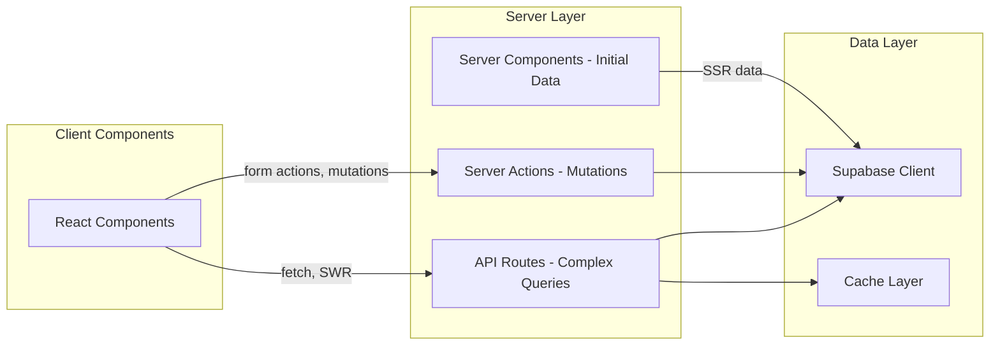
```mermaid
graph LR
    subgraph "Client Components"
        CC[React Components]
    end

    subgraph "Server Layer"
        SA[Server Actions - Mutations]
        AR[API Routes - Complex Queries]
        SC[Server Components - Initial Data]
    end

    subgraph "Data Layer"
        SB[Supabase Client]
        CACHE[Cache Layer]
    end

    CC -->|form actions, mutations| SA
    CC -->|fetch, SWR| AR
    SC -->|SSR data| SB
    SA --> SB
    AR --> SB
    AR --> CACHE
```

### 6.2 API Endpoints

#### Authentication

| Method | Endpoint | Description |
|--------|----------|-------------|
| POST | `/api/auth/signup` | Register new user |
| POST | `/api/auth/signin` | Sign in user |
| POST | `/api/auth/signout` | Sign out user |
| POST | `/api/auth/reset-password` | Request password reset |
| POST | `/api/auth/verify-otp` | Verify phone OTP |

#### Store Management

| Method | Endpoint | Description |
|--------|----------|-------------|
| GET | `/api/stores` | List owner's stores |
| POST | `/api/stores` | Create new store |
| GET | `/api/stores/:id` | Get store details |
| PATCH | `/api/stores/:id` | Update store |
| GET | `/api/stores/:id/settings` | Get store settings |
| PATCH | `/api/stores/:id/settings` | Update store settings |

#### Customer Management

| Method | Endpoint | Description |
|--------|----------|-------------|
| GET | `/api/stores/:storeId/customers` | List customers |
| POST | `/api/stores/:storeId/customers` | Add customer |
| GET | `/api/customers/:id` | Get customer details |
| PATCH | `/api/customers/:id` | Update customer |
| GET | `/api/customers/:id/ledger` | Get customer ledger |
| GET | `/api/customers/:id/balance` | Get balance summary |

#### Products

| Method | Endpoint | Description |
|--------|----------|-------------|
| GET | `/api/stores/:storeId/products` | List products |
| POST | `/api/stores/:storeId/products` | Create product |
| PATCH | `/api/products/:id` | Update product |
| POST | `/api/products/:id/stock` | Update stock |
| POST | `/api/stores/:storeId/products/import` | Bulk import |

#### ~~Transactions~~ (REMOVED)

> Transactions API has been removed. Use Bills + Ledger + Payments instead.

#### Payments

| Method | Endpoint | Description |
|--------|----------|-------------|
| GET | `/api/stores/:storeId/payments` | List payments |
| POST | `/api/stores/:storeId/payments` | Record payment |
| POST | `/api/payments/:id/verify` | Verify payment |
| POST | `/api/payments/:id/reject` | Reject payment |
| POST | `/api/payments/:id/dispute` | Dispute payment |

#### Reports

| Method | Endpoint | Description |
|--------|----------|-------------|
| GET | `/api/stores/:storeId/reports/dashboard` | Dashboard summary |
| GET | `/api/stores/:storeId/reports/credit` | Credit report |
| GET | `/api/stores/:storeId/reports/payments` | Payment report |
| GET | `/api/stores/:storeId/reports/overdue` | Overdue report |
| POST | `/api/stores/:storeId/reports/export` | Export report |

#### Notifications

| Method | Endpoint | Description |
|--------|----------|-------------|
| GET | `/api/notifications` | Get user notifications |
| PATCH | `/api/notifications/:id/read` | Mark as read |
| GET | `/api/notifications/preferences` | Get preferences |
| PATCH | `/api/notifications/preferences` | Update preferences |

#### Billing (NEW)

| Method | Endpoint | Description |
|--------|----------|-------------|
| GET | `/api/stores/:storeId/bills` | List bills |
| POST | `/api/stores/:storeId/bills` | Create draft bill |
| GET | `/api/bills/:id` | Get bill with items |
| PATCH | `/api/bills/:id` | Update draft bill |
| POST | `/api/bills/:id/items` | Add items to bill |
| PATCH | `/api/bills/:id/items/:itemId` | Update bill item |
| DELETE | `/api/bills/:id/items/:itemId` | Remove bill item |
| POST | `/api/bills/:id/finalize` | Finalize bill |
| POST | `/api/bills/:id/cancel` | Cancel bill |
| GET | `/api/bills/:id/invoice` | Generate/download invoice PDF |
| POST | `/api/bills/:id/duplicate` | Duplicate bill as new draft |

#### EMI / Installments (NEW)

| Method | Endpoint | Description |
|--------|----------|-------------|
| GET | `/api/stores/:storeId/installments` | List all installment plans |
| POST | `/api/stores/:storeId/installments` | Create installment plan |
| GET | `/api/installments/:id` | Get plan with schedule |
| GET | `/api/installments/:id/schedule` | Get payment schedule |
| POST | `/api/installments/:id/pay` | Record installment payment |
| PATCH | `/api/installments/:id/restructure` | Restructure plan |
| POST | `/api/installments/:id/cancel` | Cancel plan |
| GET | `/api/stores/:storeId/installments/overdue` | Overdue installments |

#### Payment Configuration (NEW)

| Method | Endpoint | Description |
|--------|----------|-------------|
| GET | `/api/stores/:storeId/payment-config` | Get payment config |
| PATCH | `/api/stores/:storeId/payment-config` | Update payment config |
| POST | `/api/stores/:storeId/payment-config/qr` | Upload QR code |
| DELETE | `/api/stores/:storeId/payment-config/qr` | Delete QR code |

#### Customer Invitation (NEW)

| Method | Endpoint | Description |
|--------|----------|-------------|
| POST | `/api/stores/:storeId/customers/:id/invite` | Send invitation |
| POST | `/api/invitations/:token/accept` | Accept invitation |
| POST | `/api/stores/:storeId/customers/:id/resend-invite` | Resend invitation |

#### Inventory / Purchase (NEW)

| Method | Endpoint | Description |
|--------|----------|-------------|
| GET | `/api/stores/:storeId/inventory/summary` | Inventory overview |
| GET | `/api/stores/:storeId/inventory/movements` | Stock movements |
| POST | `/api/stores/:storeId/purchases` | Record purchase entry |
| GET | `/api/stores/:storeId/purchases` | List purchase entries |
| POST | `/api/products/:id/stock-in` | Stock in |
| POST | `/api/products/:id/stock-out` | Stock out |

#### Audit Logs (NEW)

| Method | Endpoint | Description |
|--------|----------|-------------|
| GET | `/api/stores/:storeId/audit-logs` | Get audit logs |
| GET | `/api/audit-logs/entity/:type/:id` | Entity history |
| POST | `/api/stores/:storeId/audit-logs/export` | Export audit logs |

#### Customer Dashboard (NEW)

| Method | Endpoint | Description |
|--------|----------|-------------|
| GET | `/api/customer/dashboard` | Customer overview |
| GET | `/api/customer/stores` | Linked stores list |
| GET | `/api/customer/stores/:storeId/balance` | Balance at store |
| GET | `/api/customer/stores/:storeId/transactions` | Transactions at store |
| GET | `/api/customer/stores/:storeId/bills` | Bills from store |
| GET | `/api/customer/installments` | All installment plans |
| GET | `/api/customer/upcoming-dues` | Upcoming dues |
| POST | `/api/customer/stores/:storeId/pay` | Submit payment |

#### Scheduled Reports (NEW)

| Method | Endpoint | Description |
|--------|----------|-------------|
| GET | `/api/stores/:storeId/scheduled-reports` | List scheduled reports |
| POST | `/api/stores/:storeId/scheduled-reports` | Create scheduled report |
| PATCH | `/api/scheduled-reports/:id` | Update scheduled report |
| DELETE | `/api/scheduled-reports/:id` | Delete scheduled report |

#### Notification Configuration (NEW)

| Method | Endpoint | Description |
|--------|----------|-------------|
| GET | `/api/stores/:storeId/notification-config` | Get notification config |
| PATCH | `/api/stores/:storeId/notification-config` | Update notification config |
| POST | `/api/stores/:storeId/notification-config/test` | Test channel |

#### Customer Ledger (NEW)

| Method | Endpoint | Description |
|--------|----------|-------------|
| GET | `/api/customers/:id/ledger` | Get ledger entries (paginated) |
| GET | `/api/customers/:id/ledger/summary` | Ledger summary (totals) |
| GET | `/api/customers/:id/ledger/balance` | Current running balance |
| POST | `/api/customers/:id/ledger/export` | Export ledger (PDF/CSV) |
| POST | `/api/customers/:id/ledger/reconcile` | Reconcile ledger vs balance |

#### Due Reminder Rules (NEW)

| Method | Endpoint | Description |
|--------|----------|-------------|
| GET | `/api/stores/:storeId/reminder-rules` | List all reminder rules |
| POST | `/api/stores/:storeId/reminder-rules` | Create reminder rule |
| PATCH | `/api/reminder-rules/:id` | Update reminder rule |
| DELETE | `/api/reminder-rules/:id` | Delete reminder rule |
| GET | `/api/customers/:id/active-reminders` | Customer's active reminders |

#### Owner Dashboard Metrics (NEW)

| Method | Endpoint | Description |
|--------|----------|-------------|
| GET | `/api/stores/:storeId/dashboard/metrics` | Full dashboard metrics |
| GET | `/api/stores/:storeId/dashboard/metrics/:type/history` | Metric history (trend) |

#### Central Configuration (NEW)

| Method | Endpoint | Description |
|--------|----------|-------------|
| GET | `/api/stores/:storeId/config` | Get full central config |
| PATCH | `/api/stores/:storeId/config/shop-info` | Update shop info |
| GET | `/api/stores/:storeId/config/smtp` | Get SMTP config |
| PATCH | `/api/stores/:storeId/config/smtp` | Update SMTP config |
| POST | `/api/stores/:storeId/config/smtp/test` | Test SMTP connection |

### 6.3 API Response Format

```typescript
interface ApiResponse<T> {
  success: boolean
  data?: T
  error?: ApiError
  pagination?: PaginationMeta
}

interface ApiError {
  code: string
  message: string
  details?: Record<string, string[]>
}

interface PaginationMeta {
  page: number
  pageSize: number
  totalCount: number
  totalPages: number
  hasNext: boolean
  hasPrev: boolean
}

// Standard query parameters for list endpoints
interface ListQueryParams {
  page?: number
  pageSize?: number
  sortBy?: string
  sortOrder?: 'asc' | 'desc'
  search?: string
  filters?: Record<string, string>
}
```

### 6.4 Server Actions (Mutations)

```typescript
// Credit transaction creation
async function createCreditTransaction(formData: FormData): Promise<ActionResult<Transaction>>

// Payment recording
async function recordPayment(formData: FormData): Promise<ActionResult<Payment>>

// Customer creation
async function addCustomer(formData: FormData): Promise<ActionResult<Customer>>

// Payment verification
async function verifyPayment(paymentId: string, approved: boolean): Promise<ActionResult<Payment>>

interface ActionResult<T> {
  success: boolean
  data?: T
  error?: string
  fieldErrors?: Record<string, string[]>
}
```

## 7. Security Requirements

### 7.1 Authentication Security

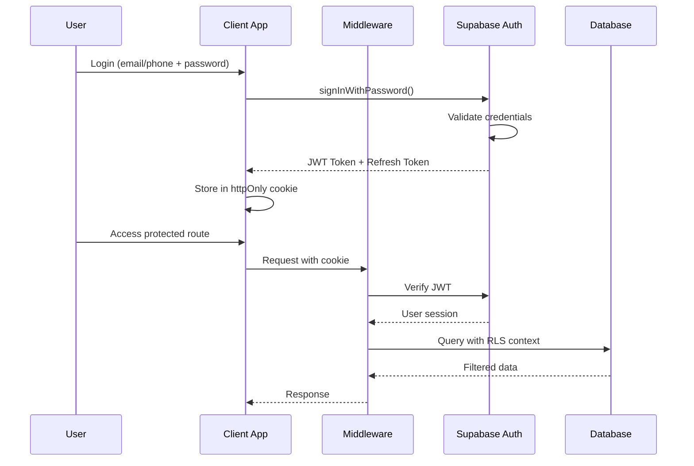
```mermaid
sequenceDiagram
    participant U as User
    participant C as Client App
    participant M as Middleware
    participant A as Supabase Auth
    participant D as Database

    U->>C: Login (email/phone + password)
    C->>A: signInWithPassword()
    A->>A: Validate credentials
    A-->>C: JWT Token + Refresh Token
    C->>C: Store in httpOnly cookie
    
    U->>C: Access protected route
    C->>M: Request with cookie
    M->>A: Verify JWT
    A-->>M: User session
    M->>D: Query with RLS context
    D-->>M: Filtered data
    M-->>C: Response
```

### 7.2 Security Measures

| Category | Measure | Implementation |
|----------|---------|----------------|
| Authentication | JWT-based sessions | Supabase Auth with httpOnly cookies |
| Authorization | Row Level Security | PostgreSQL RLS policies per table |
| Data Isolation | Multi-tenant isolation | RLS ensures store-scoped data access |
| Input Validation | Schema validation | Zod schemas on all inputs |
| Rate Limiting | API rate limits | Middleware-based per-IP and per-user limits |
| CSRF Protection | Token-based | Next.js built-in CSRF protection |
| XSS Prevention | Content sanitization | CSP headers + DOMPurify for user content |
| SQL Injection | Parameterized queries | Supabase client handles parameterization |
| File Upload Security | Type & size validation | Allowed types whitelist, max 5MB |
| Data Encryption | At-rest & in-transit | Supabase manages TLS + AES-256 |
| Audit Logging | Action tracking | All sensitive operations logged |
| Session Management | Auto-expiry | 1hr access token, 7d refresh token |

### 7.3 Row Level Security Strategy

```sql
-- Example RLS policies (conceptual)

-- Store owners can only see their own stores
CREATE POLICY "store_owner_isolation" ON stores
  FOR ALL USING (owner_id = auth.uid());

-- Customers visible only to their store owner
CREATE POLICY "customer_store_isolation" ON customers
  FOR ALL USING (
    store_id IN (SELECT id FROM stores WHERE owner_id = auth.uid())
  );

-- Customers can see their own record
CREATE POLICY "customer_self_read" ON customers
  FOR SELECT USING (linked_user_id = auth.uid());

-- Transactions scoped to store
CREATE POLICY "transaction_store_isolation" ON transactions
  FOR ALL USING (
    store_id IN (SELECT id FROM stores WHERE owner_id = auth.uid())
  );

-- Customer can read own transactions
CREATE POLICY "transaction_customer_read" ON transactions
  FOR SELECT USING (
    customer_id IN (SELECT id FROM customers WHERE linked_user_id = auth.uid())
  );
```

### 7.4 Input Validation Schema Examples

```typescript
import { z } from 'zod'

const CreateTransactionSchema = z.object({
  customer_id: z.string().uuid(),
  type: z.enum(['credit', 'payment', 'refund', 'adjustment']),
  amount: z.number().positive().max(1000000),
  description: z.string().max(500).optional(),
  items: z.array(z.object({
    product_id: z.string().uuid().optional(),
    description: z.string().min(1).max(200),
    quantity: z.number().positive(),
    unit_price: z.number().nonnegative(),
  })).min(1).max(100),
})

const RecordPaymentSchema = z.object({
  customer_id: z.string().uuid(),
  amount: z.number().positive().max(1000000),
  method: z.enum(['cash', 'upi', 'bank_transfer', 'cheque', 'other']),
  reference_id: z.string().max(100).optional(),
  notes: z.string().max(500).optional(),
})
```

## 8. Notification Architecture

### 8.1 Notification Flow

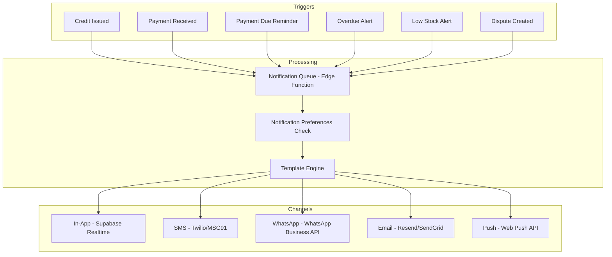
```mermaid
graph TD
    subgraph "Triggers"
        T1[Credit Issued]
        T2[Payment Received]
        T3[Payment Due Reminder]
        T4[Overdue Alert]
        T5[Low Stock Alert]
        T6[Dispute Created]
    end

    subgraph "Processing"
        NQ[Notification Queue - Edge Function]
        NP[Notification Preferences Check]
        NT[Template Engine]
    end

    subgraph "Channels"
        IA[In-App - Supabase Realtime]
        SM[SMS - Twilio/MSG91]
        WA[WhatsApp - WhatsApp Business API]
        EM[Email - Resend/SendGrid]
        PU[Push - Web Push API]
    end

    T1 --> NQ
    T2 --> NQ
    T3 --> NQ
    T4 --> NQ
    T5 --> NQ
    T6 --> NQ

    NQ --> NP
    NP --> NT
    NT --> IA
    NT --> SM
    NT --> WA
    NT --> EM
    NT --> PU
```

### 8.2 Notification Types and Channels

| Notification Type | Default Channel | Store Owner | Customer |
|-------------------|----------------|-------------|----------|
| Credit Issued | In-App + SMS | ✓ | ✓ |
| Payment Received | In-App | ✓ | ✓ |
| Payment Reminder | SMS/WhatsApp | Configure | ✓ |
| Overdue Alert | SMS + In-App | ✓ | ✓ |
| Low Stock | In-App | ✓ | - |
| Report Ready | In-App + Email | ✓ | - |
| Dispute Created | In-App + SMS | ✓ | ✓ |
| Payment Verified | In-App | - | ✓ |

### 8.3 Scheduled Reminder System

```typescript
interface ScheduledReminder {
  id: string
  store_id: string
  customer_id: string
  type: 'payment_due' | 'overdue' | 'custom'
  frequency: 'once' | 'daily' | 'weekly' | 'monthly'
  channels: NotificationChannel[]
  message_template: string
  next_run_at: string
  last_run_at?: string
  is_active: boolean
  config: {
    days_before_due?: number
    days_after_overdue?: number
    max_reminders?: number
    reminder_count: number
  }
}

// Edge Function: Cron-triggered reminder processor
// Runs every hour to check for due reminders
// Respects quiet hours (9 AM - 9 PM local time)
```

### 8.4 Real-time Notifications (In-App)

```typescript
// Supabase Realtime subscription for in-app notifications
interface RealtimeNotificationConfig {
  channel: 'notifications'
  event: 'INSERT'
  filter: `user_id=eq.${userId}`
  callback: (payload: Notification) => void
}

// Client-side subscription
const subscribeToNotifications = (userId: string, onNotification: (n: Notification) => void) => {
  return supabase
    .channel('user-notifications')
    .on('postgres_changes', {
      event: 'INSERT',
      schema: 'public',
      table: 'notifications',
      filter: `user_id=eq.${userId}`
    }, (payload) => onNotification(payload.new as Notification))
    .subscribe()
}
```


## 9. Reporting Architecture

### 9.1 Reporting System Overview

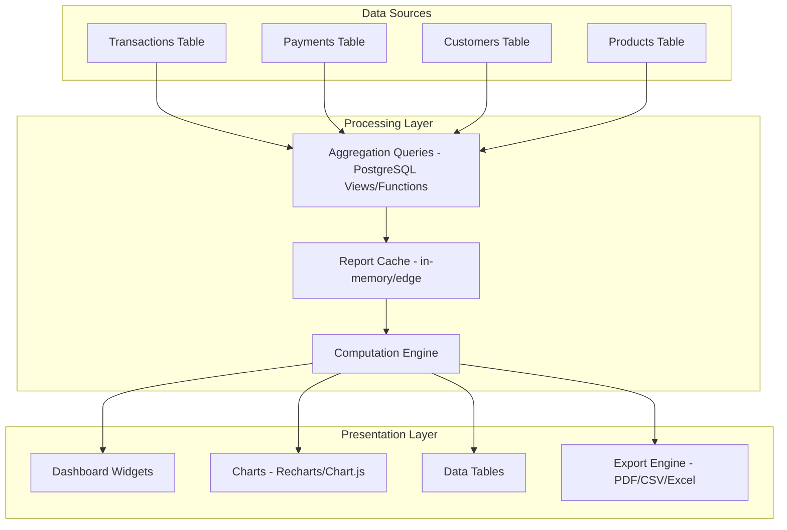
```mermaid
graph TD
    subgraph "Data Sources"
        TX[Transactions Table]
        PY[Payments Table]
        CU[Customers Table]
        PR[Products Table]
    end

    subgraph "Processing Layer"
        AGG[Aggregation Queries - PostgreSQL Views/Functions]
        CACHE[Report Cache - in-memory/edge]
        COMP[Computation Engine]
    end

    subgraph "Presentation Layer"
        DASH[Dashboard Widgets]
        CHT[Charts - Recharts/Chart.js]
        TBL[Data Tables]
        EXP[Export Engine - PDF/CSV/Excel]
    end

    TX --> AGG
    PY --> AGG
    CU --> AGG
    PR --> AGG
    AGG --> CACHE
    CACHE --> COMP
    COMP --> DASH
    COMP --> CHT
    COMP --> TBL
    COMP --> EXP
```

### 9.2 Report Types

#### Dashboard Summary (Real-time)
- Today's credit issued / payments received
- Total outstanding balance across all customers
- Overdue accounts count and total amount
- Monthly trend chart (credit vs payments)
- Top 5 debtors
- Recent transactions feed

#### Credit Report
- Credit issued by date range (daily/weekly/monthly aggregation)
- Credit by customer breakdown
- Credit by product category
- Average credit per transaction
- Credit limit utilization across customers

#### Payment Report
- Payments received by date range
- Payment method distribution (pie chart)
- Collection efficiency ratio (collected / due)
- Payment delays analysis
- Disputed payments summary

#### Customer Report
- Customer credit ranking
- Trust score distribution
- Active vs inactive customers
- Customer lifetime value
- Payment behavior patterns

#### Overdue Report
- All overdue accounts with aging buckets (30/60/90+ days)
- Total overdue amount
- Risk categorization (low/medium/high/critical)
- Suggested actions per customer
- Historical overdue trends

#### Product Report
- Best-selling products (by credit transactions)
- Low stock alerts
- Revenue by product/category
- Stock movement history

### 9.3 Database Views for Reporting

```typescript
// Materialized views for expensive aggregations (refreshed periodically)
interface ReportViews {
  // Daily aggregation of transactions per store
  'mv_daily_store_summary': {
    store_id: string
    date: string
    total_credit: number
    total_payments: number
    transaction_count: number
    new_customers: number
  }

  // Customer balance aging
  'mv_customer_aging': {
    customer_id: string
    store_id: string
    current: number      // 0-30 days
    days_30: number      // 31-60 days
    days_60: number      // 61-90 days
    days_90_plus: number // 90+ days
    total_overdue: number
  }

  // Product performance
  'mv_product_performance': {
    product_id: string
    store_id: string
    period: string
    total_quantity_sold: number
    total_revenue: number
    transaction_count: number
  }
}
```

### 9.4 Export Architecture

```typescript
interface ExportConfig {
  format: 'pdf' | 'csv' | 'excel'
  template?: string
  includeCharts: boolean
  dateRange: DateRange
  filters?: Record<string, unknown>
}

// PDF generation via Edge Function (using jsPDF or Puppeteer)
// CSV/Excel generation client-side for small datasets
// Large exports queued and delivered via notification when ready
```

## 10. Payment Verification Flow

### 10.1 Payment Lifecycle

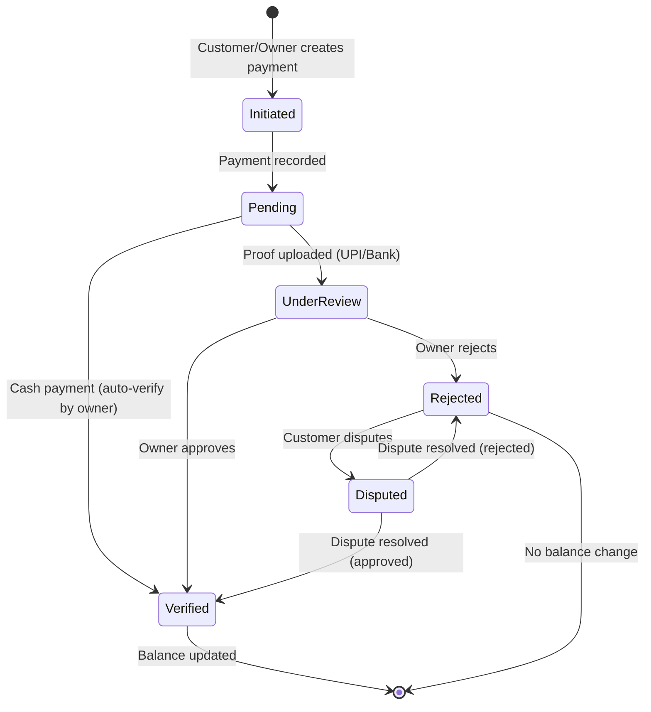
```mermaid
stateDiagram-v2
    [*] --> Initiated: Customer/Owner creates payment
    Initiated --> Pending: Payment recorded
    Pending --> UnderReview: Proof uploaded (UPI/Bank)
    Pending --> Verified: Cash payment (auto-verify by owner)
    UnderReview --> Verified: Owner approves
    UnderReview --> Rejected: Owner rejects
    Rejected --> Disputed: Customer disputes
    Disputed --> Verified: Dispute resolved (approved)
    Disputed --> Rejected: Dispute resolved (rejected)
    Verified --> [*]: Balance updated
    Rejected --> [*]: No balance change
```

### 10.2 Payment Verification Sequence

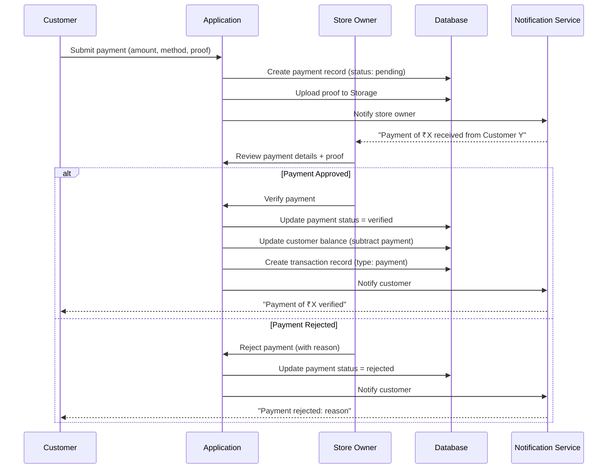
```mermaid
sequenceDiagram
    participant C as Customer
    participant App as Application
    participant SO as Store Owner
    participant DB as Database
    participant N as Notification Service

    C->>App: Submit payment (amount, method, proof)
    App->>DB: Create payment record (status: pending)
    App->>DB: Upload proof to Storage
    App->>N: Notify store owner
    N-->>SO: "Payment of ₹X received from Customer Y"
    
    SO->>App: Review payment details + proof
    
    alt Payment Approved
        SO->>App: Verify payment
        App->>DB: Update payment status = verified
        App->>DB: Update customer balance (subtract payment)
        App->>DB: Create transaction record (type: payment)
        App->>N: Notify customer
        N-->>C: "Payment of ₹X verified"
    else Payment Rejected
        SO->>App: Reject payment (with reason)
        App->>DB: Update payment status = rejected
        App->>N: Notify customer
        N-->>C: "Payment rejected: reason"
    end
```

### 10.3 Payment Methods and Verification Rules

| Method | Verification Type | Auto-Verify | Proof Required |
|--------|-------------------|-------------|----------------|
| Cash | Store owner confirms | Optional (configurable) | No |
| UPI | Reference ID + screenshot | No | Yes |
| Bank Transfer | Transaction reference | No | Yes |
| Cheque | Cheque number + clearing | No | Yes (photo) |
| Other | Store owner discretion | No | Optional |

### 10.4 Dispute Resolution Flow

```typescript
interface Dispute {
  id: string
  payment_id: string
  raised_by: string   // customer user_id
  reason: string
  evidence_urls: string[]
  status: 'open' | 'under_review' | 'resolved'
  resolution?: {
    outcome: 'approved' | 'rejected'
    resolved_by: string
    resolution_note: string
    resolved_at: string
  }
  created_at: string
}

// Dispute SLA: Store owner must respond within 48 hours
// Escalation: If unresolved, system flags for review
```

## 11. Non-Functional Requirements

### 11.1 Performance Requirements

| Metric | Target | Measurement |
|--------|--------|-------------|
| Page Load (FCP) | < 1.5s | Lighthouse |
| Time to Interactive | < 3s | Lighthouse |
| API Response Time (p95) | < 500ms | Server metrics |
| Database Query Time (p95) | < 200ms | Supabase dashboard |
| Real-time Notification Delay | < 2s | End-to-end measurement |
| Report Generation | < 5s (standard), < 30s (large export) | Timing |
| Concurrent Users | 500+ per store | Load testing |

### 11.2 Scalability Requirements

| Aspect | Design Decision |
|--------|-----------------|
| Data Volume | Partitioned tables for transactions (by month) |
| Multi-Store | Single database with RLS isolation |
| Read Scaling | Materialized views for reports, edge caching |
| Write Scaling | Supabase managed PostgreSQL with connection pooling |
| File Storage | Supabase Storage with CDN for proof images |
| Background Jobs | Supabase Edge Functions with pg_cron |

### 11.3 Availability & Reliability

- Target uptime: 99.9% (Supabase SLA)
- Data backup: Automated daily backups (Supabase managed)
- Point-in-time recovery: Up to 7 days
- Disaster recovery: Multi-region Supabase project (future)
- Graceful degradation: Offline-capable for critical operations (PWA)

### 11.4 Data Retention

| Data Type | Retention Period | Archive Strategy |
|-----------|-----------------|-----------------|
| Transactions | Indefinite | Partition by year after 2 years |
| Payments | Indefinite | Partition by year after 2 years |
| Notifications | 90 days | Auto-delete after TTL |
| Audit Logs | 1 year | Archive to cold storage |
| Reports Cache | 24 hours | Auto-invalidate |
| Uploaded Proofs | 1 year after verification | Move to archive bucket |

## 12. Future Scalability Design

### 12.1 Phase-wise Scalability Roadmap

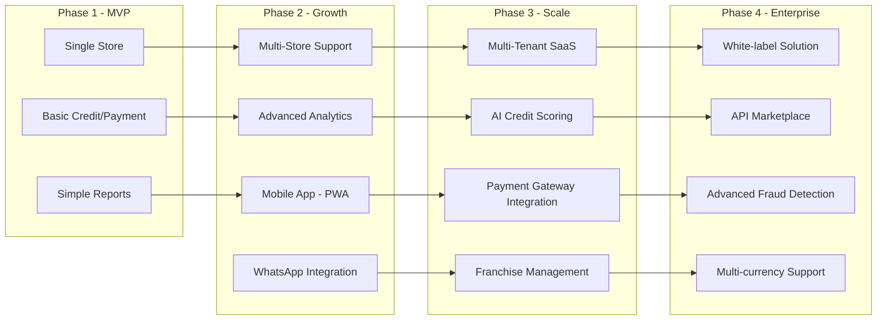
```mermaid
graph LR
    subgraph "Phase 1 - MVP"
        P1A[Single Store]
        P1B[Basic Credit/Payment]
        P1C[Simple Reports]
    end

    subgraph "Phase 2 - Growth"
        P2A[Multi-Store Support]
        P2B[Advanced Analytics]
        P2C[Mobile App - PWA]
        P2D[WhatsApp Integration]
    end

    subgraph "Phase 3 - Scale"
        P3A[Multi-Tenant SaaS]
        P3B[AI Credit Scoring]
        P3C[Payment Gateway Integration]
        P3D[Franchise Management]
    end

    subgraph "Phase 4 - Enterprise"
        P4A[White-label Solution]
        P4B[API Marketplace]
        P4C[Advanced Fraud Detection]
        P4D[Multi-currency Support]
    end

    P1A --> P2A
    P1B --> P2B
    P1C --> P2C
    P2A --> P3A
    P2B --> P3B
    P2C --> P3C
    P2D --> P3D
    P3A --> P4A
    P3B --> P4B
    P3C --> P4C
    P3D --> P4D
```

### 12.2 Architectural Decisions for Scale

| Decision | Rationale | Future Migration Path |
|----------|-----------|----------------------|
| Supabase as BaaS | Rapid MVP development, managed infra | Can migrate to self-hosted Supabase or custom backend |
| PostgreSQL | ACID compliance for financial data | Horizontal read replicas when needed |
| Next.js App Router | SSR + Client flexibility | Micro-frontend decomposition possible |
| Redux Toolkit | Predictable state for complex flows | Can scale with RTK Query caching |
| Edge Functions | Serverless scaling for background jobs | Can migrate to dedicated workers |
| RLS for multi-tenancy | Simple isolation without app changes | Can add schema-per-tenant later |

### 12.3 Extensibility Points

```typescript
// Plugin architecture for future extensions
interface SystemExtension {
  name: string
  version: string
  hooks: ExtensionHooks
}

interface ExtensionHooks {
  onTransactionCreated?: (tx: Transaction) => Promise<void>
  onPaymentVerified?: (payment: Payment) => Promise<void>
  onCustomerCreated?: (customer: Customer) => Promise<void>
  beforeCreditApproval?: (tx: Transaction) => Promise<boolean>
  customReportGenerator?: (params: ReportParams) => Promise<ReportData>
}

// Future integrations via hooks:
// - Accounting software sync (Tally, Zoho Books)
// - Credit bureau reporting
// - AI-based risk assessment
// - Automated collection workflows
// - Multi-language support
// - Custom billing templates
```

## 13. Testing Strategy

### 13.1 Testing Pyramid

| Layer | Tools | Coverage Target |
|-------|-------|-----------------|
| Unit Tests | Vitest | 80%+ for business logic |
| Integration Tests | Vitest + Supabase local | API routes, RLS policies |
| E2E Tests | Playwright | Critical user flows |
| Performance Tests | k6 / Lighthouse CI | Key metrics within SLA |

### 13.2 Key Test Scenarios

**Credit Management**:
- Credit cannot exceed customer limit
- Balance updates correctly on credit/payment
- Voided transactions reverse balance
- Concurrent transactions maintain consistency

**Payment Verification**:
- Only store owner can verify payments
- Verified payment updates balance atomically
- Rejected payment does not affect balance
- Dispute flow maintains correct status transitions

**Security**:
- RLS prevents cross-store data access
- Invalid tokens are rejected
- Rate limiting activates under load
- Input validation catches malicious payloads

## 14. Error Handling

### 14.1 Error Categories

| Category | HTTP Code | User Message | Logging |
|----------|-----------|--------------|---------|
| Validation | 400 | Field-specific errors | Debug |
| Authentication | 401 | "Please sign in" | Info |
| Authorization | 403 | "Access denied" | Warning |
| Not Found | 404 | "Resource not found" | Debug |
| Conflict | 409 | "Operation conflict" | Warning |
| Rate Limited | 429 | "Too many requests" | Warning |
| Server Error | 500 | "Something went wrong" | Error + Alert |

### 14.2 Business Logic Errors

```typescript
type BusinessError =
  | { code: 'CREDIT_LIMIT_EXCEEDED'; limit: number; requested: number }
  | { code: 'INSUFFICIENT_STOCK'; available: number; requested: number }
  | { code: 'PAYMENT_ALREADY_VERIFIED'; paymentId: string }
  | { code: 'CUSTOMER_INACTIVE'; customerId: string }
  | { code: 'STORE_INACTIVE'; storeId: string }
  | { code: 'DUPLICATE_TRANSACTION'; referenceNumber: string }
  | { code: 'INVALID_STATUS_TRANSITION'; from: string; to: string }
```

## 15. Dependencies

### 15.1 Core Dependencies

| Package | Purpose | Version Strategy |
|---------|---------|-----------------|
| next | Framework | ^16.x (current) |
| react | UI Library | ^19.x |
| @supabase/supabase-js | Backend client | ^2.x |
| @supabase/ssr | SSR auth helpers | ^0.x |
| @reduxjs/toolkit | State management | ^2.x |
| @mui/material | UI components | ^6.x |
| zod | Schema validation | ^3.x |

### 15.2 Additional Dependencies

| Package | Purpose |
|---------|---------|
| @mui/x-data-grid | Data tables for reports |
| @mui/x-date-pickers | Date range selection |
| recharts | Charts and analytics |
| jspdf | PDF report generation |
| xlsx | Excel export |
| date-fns | Date manipulation |
| react-hook-form | Form management |
| @hookform/resolvers | Zod + React Hook Form integration |

### 15.3 Development Dependencies

| Package | Purpose |
|---------|---------|
| vitest | Unit/integration testing |
| @playwright/test | E2E testing |
| supabase (CLI) | Local development |
| @faker-js/faker | Test data generation |

## 16. Correctness Properties

### 16.1 Financial Integrity Invariants

- **Balance Consistency (Source of Truth)**: `customer.current_balance` MUST equal the latest `ledger_entries.balance_after` for that customer
- **Ledger Derivation**: For any customer, the balance can be derived: `SUM(debit_amounts) - SUM(credit_amounts) = current_balance`
- **Non-negative Credit**: A bill cannot be finalized if it would cause the customer's balance to exceed their credit limit
- **Atomic Balance Updates**: Ledger entry creation + customer balance update must be atomic (database transaction)
- **Payment Idempotency**: The same payment reference_id cannot be recorded twice for the same store
- **Bill Total Consistency**: `bill.total_amount = SUM(bill_items.total_price) - bill.discount_amount + bill.tax_amount`
- **Installment Plan Consistency**: `plan.total_paid + plan.remaining_amount = plan.total_amount`
- **Profit Calculation**: `product.profit_amount = product.effective_price - product.purchase_price` (always consistent)

### 16.2 Access Control Invariants

- **Store Isolation**: A store owner can never read or modify data belonging to another store
- **Customer Scope**: A customer can only view their own transactions and balance
- **Verification Authority**: Only store owners can verify or reject payments
- **Void Authority**: Only store owners can void transactions
- **Audit Immutability**: Audit logs can never be modified or deleted by any user
- **Invitation Scope**: Customer can only accept invitations addressed to their phone/email

### 16.3 Status Transition Invariants

- **Payment Status**: `pending → verified | rejected`, `rejected → disputed`, `disputed → verified | rejected` (no other transitions allowed)
- **Bill Status**: `draft → finalized | cancelled`, `finalized → partially_paid | paid | overdue | cancelled` (draft cannot skip to paid)
- **Installment Status**: `active → completed | overdue | defaulted | cancelled` (completed is terminal)
- **Invitation Status**: `pending → accepted | expired` (accepted is terminal)
- **Reminder Status**: Active reminders must have `next_send_at` in the future

### 16.4 Inventory Invariants (NEW)

- **Stock Non-negative**: `product.stock_quantity >= 0` always (stock_out fails if insufficient)
- **Stock Movement Trail**: `product.stock_quantity = initial_stock + SUM(stock_in) - SUM(stock_out)`
- **Purchase Entry Immutability**: Purchase entries cannot be deleted, only adjustment entries can be added

### 16.5 Ledger Invariants (NEW)

- **Ledger Balance Consistency**: `ledger_entry.balance_after = ledger_entry.balance_before + debit_amount - credit_amount`
- **Ledger-Customer Sync**: The latest `ledger_entry.balance_after` for a customer must equal `customer.current_balance`
- **Ledger Immutability**: Ledger entries are append-only — never updated or deleted
- **Ledger Completeness**: Every bill finalization creates exactly one credit ledger entry; every verified payment creates exactly one debit ledger entry
- **No Orphan Entries**: Every ledger entry must reference a valid bill, payment, refund, or adjustment

## 16A. Soft Delete Strategy (NEW)

All business entities use soft delete instead of hard delete to maintain data integrity, audit trail, and enable recovery.

### Soft Delete Fields (added to all deletable tables)

```typescript
interface SoftDeletable {
  is_deleted: boolean          // default: false
  deleted_at: string | null    // timestamp when soft-deleted
  deleted_by: string | null    // user_id who performed the deletion
}
```

### Tables with Soft Delete

| Table | Soft Delete | Reason |
|-------|-------------|--------|
| `customers` | ✓ | Financial history must be preserved |
| `products` | ✓ | Referenced by bills and transactions |
| `bills` | ✓ | Financial records |
| `installment_plans` | ✓ | Payment history |
| `stores` | ✓ | Owner may reactivate |
| `categories` | ✓ | Products reference them |
| `scheduled_reports` | ✓ | Audit trail |
| `due_reminder_rules` | ✓ | History |

### Tables WITHOUT Soft Delete (immutable/append-only)

| Table | Reason |
|-------|--------|
| `ledger_entries` | Append-only, never deleted |
| `audit_logs` | Immutable audit trail |
| `transactions` | Voided instead of deleted |
| `payments` | Status-managed, never deleted |
| `stock_movements` | Append-only trail |
| `purchase_entries` | Immutable record |
| `notifications` | TTL-based auto-cleanup |

### Implementation

```sql
-- All queries automatically filter soft-deleted records
-- RLS policies include: AND (is_deleted = false)

-- Example RLS with soft delete
CREATE POLICY "customers_store_owner" ON customers
  FOR ALL USING (
    is_deleted = false AND
    store_id IN (SELECT id FROM stores WHERE owner_id = auth.uid() AND is_deleted = false)
  );

-- Admin/audit view can see deleted records
CREATE POLICY "customers_admin_view_deleted" ON customers
  FOR SELECT USING (
    store_id IN (SELECT id FROM stores WHERE owner_id = auth.uid())
  );  -- no is_deleted filter for audit purposes
```

### Soft Delete Rules

1. Soft-deleted records are hidden from all standard queries (via RLS)
2. Related child records are NOT cascade-deleted (preserved for history)
3. Store owner can view deleted records in an "Archive" section
4. Hard delete only via scheduled cleanup job (after retention period)
5. Unique constraints include `WHERE is_deleted = false` partial indexes
6. Soft-deleted customers cannot be invited again (must restore first)


## 17. New User Flows (Added)

### 17.0 Complete Ledger Flow (NEW — Critical Business Logic)

This defines the exact sequence of system operations when bills are finalized and payments are approved.

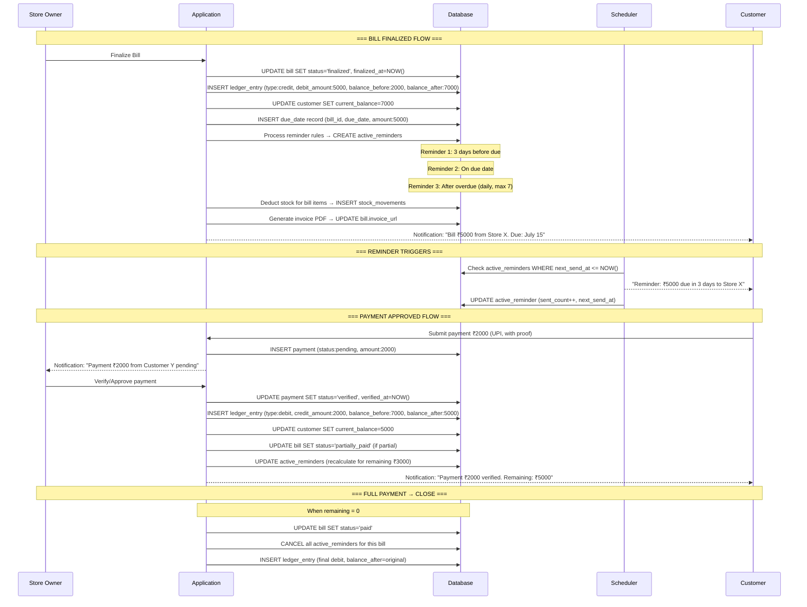
```mermaid
sequenceDiagram
    participant SO as Store Owner
    participant App as Application
    participant DB as Database
    participant CRON as Scheduler
    participant C as Customer

    Note over SO,C: === BILL FINALIZED FLOW ===
    SO->>App: Finalize Bill #INV-001 (₹5000)
    App->>DB: UPDATE bill SET status='finalized', finalized_at=NOW()
    App->>DB: INSERT ledger_entry (type:credit, debit_amount:5000, balance_before:2000, balance_after:7000)
    App->>DB: UPDATE customer SET current_balance=7000
    App->>DB: INSERT due_date record (bill_id, due_date, amount:5000)
    App->>DB: Process reminder rules → CREATE active_reminders
    Note over DB: Reminder 1: 3 days before due
    Note over DB: Reminder 2: On due date
    Note over DB: Reminder 3: After overdue (daily, max 7)
    App->>DB: Deduct stock for bill items → INSERT stock_movements
    App->>DB: Generate invoice PDF → UPDATE bill.invoice_url
    App-->>C: Notification: "Bill ₹5000 from Store X. Due: July 15"

    Note over SO,C: === REMINDER TRIGGERS ===
    CRON->>DB: Check active_reminders WHERE next_send_at <= NOW()
    CRON-->>C: "Reminder: ₹5000 due in 3 days to Store X"
    CRON->>DB: UPDATE active_reminder (sent_count++, next_send_at)

    Note over SO,C: === PAYMENT APPROVED FLOW ===
    C->>App: Submit payment ₹2000 (UPI, with proof)
    App->>DB: INSERT payment (status:pending, amount:2000)
    App-->>SO: Notification: "Payment ₹2000 from Customer Y pending"
    SO->>App: Verify/Approve payment
    App->>DB: UPDATE payment SET status='verified', verified_at=NOW()
    App->>DB: INSERT ledger_entry (type:debit, credit_amount:2000, balance_before:7000, balance_after:5000)
    App->>DB: UPDATE customer SET current_balance=5000
    App->>DB: UPDATE bill SET status='partially_paid' (if partial)
    App->>DB: UPDATE active_reminders (recalculate for remaining ₹3000)
    App-->>C: Notification: "Payment ₹2000 verified. Remaining: ₹5000"

    Note over SO,C: === FULL PAYMENT → CLOSE ===
    Note over App,DB: When remaining = 0
    App->>DB: UPDATE bill SET status='paid'
    App->>DB: CANCEL all active_reminders for this bill
    App->>DB: INSERT ledger_entry (final debit, balance_after=original)
```

**Ledger Flow Invariants**:
1. `bill_finalized` → ALWAYS creates ONE ledger credit entry (outstanding increases)
2. `payment_verified` → ALWAYS creates ONE ledger debit entry (outstanding decreases)
3. `customer.current_balance` ALWAYS equals latest `ledger_entry.balance_after`
4. Reminders are auto-created based on `due_reminder_rules` when due_date is set
5. Reminders are auto-cancelled when bill is fully paid
6. Stock is deducted ONLY on bill finalization (not on draft)

### 17.1 Customer Registration & Invitation Flow

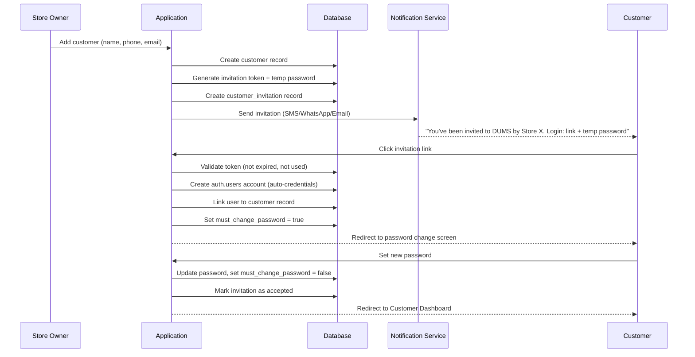
```mermaid
sequenceDiagram
    participant SO as Store Owner
    participant App as Application
    participant DB as Database
    participant N as Notification Service
    participant C as Customer

    SO->>App: Add customer (name, phone, email)
    App->>DB: Create customer record
    App->>DB: Generate invitation token + temp password
    App->>DB: Create customer_invitation record
    App->>N: Send invitation (SMS/WhatsApp/Email)
    N-->>C: "You've been invited to DUMS by Store X. Login: link + temp password"
    
    C->>App: Click invitation link
    App->>DB: Validate token (not expired, not used)
    App->>DB: Create auth.users account (auto-credentials)
    App->>DB: Link user to customer record
    App->>DB: Set must_change_password = true
    App-->>C: Redirect to password change screen
    
    C->>App: Set new password
    App->>DB: Update password, set must_change_password = false
    App->>DB: Mark invitation as accepted
    App-->>C: Redirect to Customer Dashboard
```

### 17.2 Complete Billing Flow

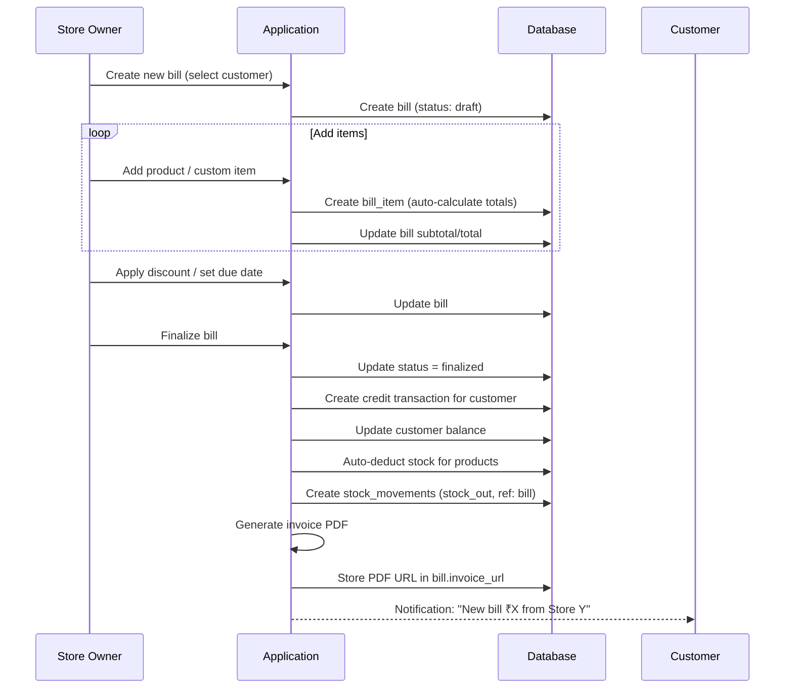
```mermaid
sequenceDiagram
    participant SO as Store Owner
    participant App as Application
    participant DB as Database
    participant C as Customer

    SO->>App: Create new bill (select customer)
    App->>DB: Create bill (status: draft)
    
    loop Add items
        SO->>App: Add product / custom item
        App->>DB: Create bill_item (auto-calculate totals)
        App->>DB: Update bill subtotal/total
    end
    
    SO->>App: Apply discount / set due date
    App->>DB: Update bill
    
    SO->>App: Finalize bill
    App->>DB: Update status = finalized
    App->>DB: Create credit transaction for customer
    App->>DB: Update customer balance
    App->>DB: Auto-deduct stock for products
    App->>DB: Create stock_movements (stock_out, ref: bill)
    App->>App: Generate invoice PDF
    App->>DB: Store PDF URL in bill.invoice_url
    App-->>C: Notification: "New bill ₹X from Store Y"
```

### 17.3 EMI / Installment Payment Flow

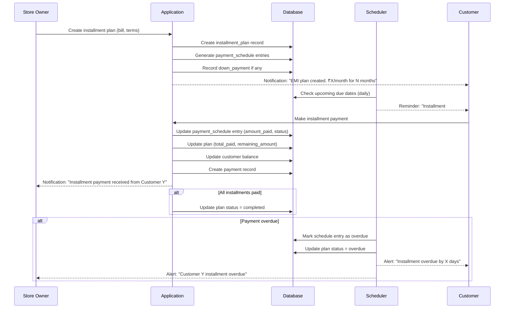
```mermaid
sequenceDiagram
    participant SO as Store Owner
    participant App as Application
    participant DB as Database
    participant CRON as Scheduler
    participant C as Customer

    SO->>App: Create installment plan (bill, terms)
    App->>DB: Create installment_plan record
    App->>DB: Generate payment_schedule entries
    App->>DB: Record down_payment if any
    App-->>C: Notification: "EMI plan created. ₹X/month for N months"
    
    CRON->>DB: Check upcoming due dates (daily)
    CRON-->>C: Reminder: "Installment #3 of ₹X due in 3 days"
    
    C->>App: Make installment payment
    App->>DB: Update payment_schedule entry (amount_paid, status)
    App->>DB: Update plan (total_paid, remaining_amount)
    App->>DB: Update customer balance
    App->>DB: Create payment record
    App-->>SO: Notification: "Installment payment received from Customer Y"
    
    alt All installments paid
        App->>DB: Update plan status = completed
    end
    
    alt Payment overdue
        CRON->>DB: Mark schedule entry as overdue
        CRON->>DB: Update plan status = overdue
        CRON-->>C: Alert: "Installment overdue by X days"
        CRON-->>SO: Alert: "Customer Y installment overdue"
    end
```

### 17.4 Inventory Purchase Entry Flow

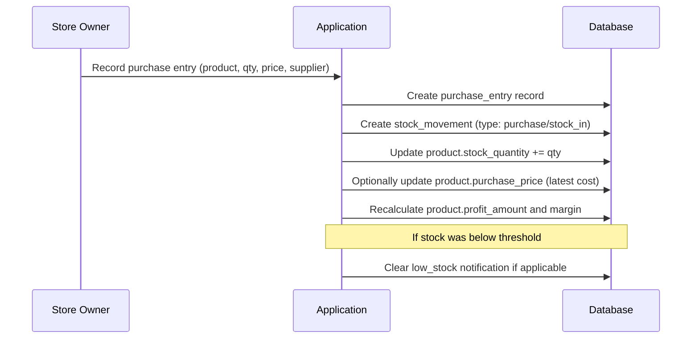
```mermaid
sequenceDiagram
    participant SO as Store Owner
    participant App as Application
    participant DB as Database

    SO->>App: Record purchase entry (product, qty, price, supplier)
    App->>DB: Create purchase_entry record
    App->>DB: Create stock_movement (type: purchase/stock_in)
    App->>DB: Update product.stock_quantity += qty
    App->>DB: Optionally update product.purchase_price (latest cost)
    App->>DB: Recalculate product.profit_amount and margin
    
    Note over App,DB: If stock was below threshold
    App->>DB: Clear low_stock notification if applicable
```

### 17.5 Customer Dashboard Flow

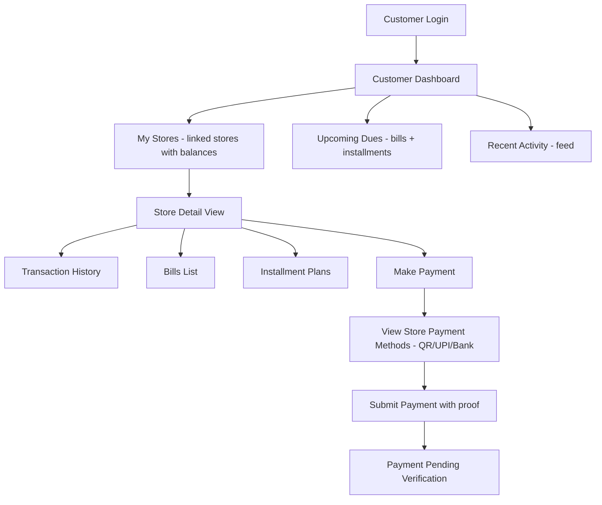
```mermaid
graph TD
    CL[Customer Login] --> CD[Customer Dashboard]
    CD --> MS[My Stores - linked stores with balances]
    CD --> UD[Upcoming Dues - bills + installments]
    CD --> RA[Recent Activity - feed]
    
    MS --> SD[Store Detail View]
    SD --> TX[Transaction History]
    SD --> BL[Bills List]
    SD --> IP[Installment Plans]
    SD --> MP[Make Payment]
    
    MP --> PM[View Store Payment Methods - QR/UPI/Bank]
    PM --> SP[Submit Payment with proof]
    SP --> PN[Payment Pending Verification]
```

### 17.6 Scheduled Report Flow

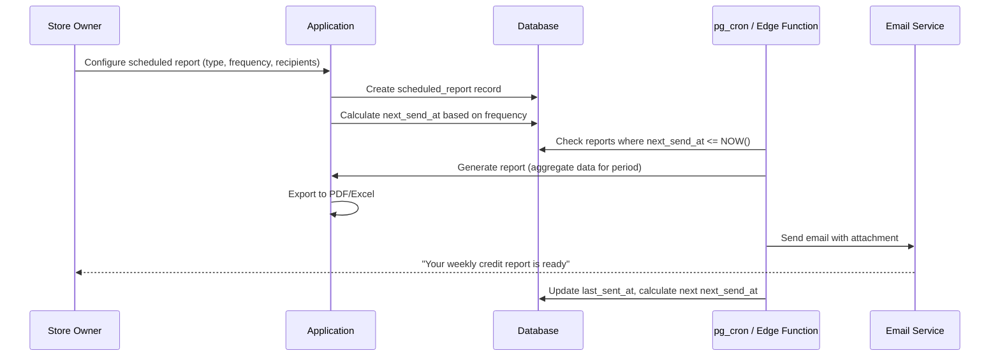
```mermaid
sequenceDiagram
    participant SO as Store Owner
    participant App as Application
    participant DB as Database
    participant CRON as pg_cron / Edge Function
    participant EMAIL as Email Service

    SO->>App: Configure scheduled report (type, frequency, recipients)
    App->>DB: Create scheduled_report record
    App->>DB: Calculate next_send_at based on frequency
    
    CRON->>DB: Check reports where next_send_at <= NOW()
    CRON->>App: Generate report (aggregate data for period)
    App->>App: Export to PDF/Excel
    CRON->>EMAIL: Send email with attachment
    EMAIL-->>SO: "Your weekly credit report is ready"
    CRON->>DB: Update last_sent_at, calculate next next_send_at
```

## 18. Database Impact Summary (Final — Post-Cleanup)

| Table | Purpose | Key Relationships |
|-------|---------|-------------------|
| `user_profiles` | Extended user info with roles | → auth.users |
| `stores` | Shop/store information | → user_profiles |
| `categories` | Product categories | → stores |
| `products` | Product catalog + pricing + profit | → stores, categories |
| `customers` | Customer records | → stores, user_profiles |
| `bills` | Complete billing lifecycle | → customers, stores |
| `bill_items` | Line items per bill | → bills, products |
| `ledger_entries` | Financial source of truth (immutable) | → customers, stores |
| `payments` | Payment records with verification | → stores, customers, bills |
| `installment_plans` | EMI/installment tracking | → customers, bills, stores |
| `payment_schedule` | Individual installment entries | → installment_plans |
| `payment_config` | Store payment acceptance config | → stores (1:1) |
| `notification_config` | Store notification settings | → stores (1:1) |
| `smtp_config` | Store email/SMTP configuration | → stores (1:1) |
| `notifications` | In-app notification records | → user_profiles |
| `due_reminder_rules` | Configurable reminder rules | → stores |
| `active_reminders` | Scheduled reminder instances | → rules, customers, bills |
| `scheduled_reminders` | Legacy reminders | → stores, customers |
| `scheduled_reports` | Automated report configuration | → stores |
| `purchase_entries` | Stock purchase records (immutable) | → products, stores |
| `stock_movements` | Inventory in/out tracking (append-only) | → products, stores |
| `audit_logs` | System-wide audit trail (immutable) | → stores, users |
| `customer_invitations` | Invitation token management | → customers, stores |

**Tables Removed in Cleanup**:
| Table | Reason |
|-------|--------|
| `transactions` | Redundant — replaced by bills + ledger_entries |
| `transaction_items` | Redundant — replaced by bill_items |

**Modified Tables**:
| Table | Changes |
|-------|---------|
| `products` | Added `purchase_price`, `selling_price`, `discount_percent`, removed `unit_price` |
| `customers` | Added `invitation_status`, soft delete fields |
| `users` | Added `must_change_password` field |
| `payments` | Removed `transaction_id` FK; Added `rejection_reason`, `bill_id`, `installment_schedule_id` |
| ALL deletable tables | Added `is_deleted`, `deleted_at`, `deleted_by` (soft delete) |

## 19. Updated Architecture Diagram

```mermaid
graph TB
    subgraph "Client Layer"
        NX[Next.js App - SSR/CSR]
        RD[Redux Toolkit Store]
        MUI[Material UI Components]
    end

    subgraph "Store Owner Modules"
        BIL[Billing Module]
        EMI[EMI Management]
        INV[Inventory & Purchase]
        LED[Customer Ledger]
        PCONF[Payment Config]
        NCONF[Notification Config]
        SMTP[SMTP Config]
        AUDIT[Audit Logs]
        SREP[Scheduled Reports]
        RULES[Due Reminder Rules]
        ODASH[Owner Dashboard Metrics]
        CCONF[Central Configuration]
    end

    subgraph "Customer Modules"
        CDASH[Customer Dashboard]
        CPAY[Customer Payments]
        CINV[Customer Invitations]
    end

    subgraph "API Layer"
        AR[Next.js API Routes / Server Actions]
        MW[Middleware - Auth, Rate Limit, Validation, Soft Delete Filter]
    end

    subgraph "Backend Services - Supabase"
        AUTH[Supabase Auth + Invitation Flow]
        DB[(PostgreSQL + RLS + Triggers + Ledger)]
        RT[Realtime Engine]
        STOR[Supabase Storage - QR, Invoices, Proofs]
        EDGE[Edge Functions - Cron, Email, PDF, Reminders]
    end

    subgraph "External Services"
        SMS[SMS/WhatsApp API]
        EMAIL[Email Service - SMTP/Resend]
        PDF[PDF Generation]
    end

    NX --> RD
    NX --> MUI
    NX --> AR
    BIL --> AR
    EMI --> AR
    INV --> AR
    LED --> AR
    PCONF --> AR
    NCONF --> AR
    SMTP --> AR
    AUDIT --> AR
    SREP --> AR
    RULES --> AR
    ODASH --> AR
    CCONF --> AR
    CDASH --> AR
    CPAY --> AR
    CINV --> AR
    AR --> MW
    MW --> AUTH
    MW --> DB
    MW --> RT
    MW --> STOR
    EDGE --> SMS
    EDGE --> EMAIL
    EDGE --> PDF
    DB --> RT
```

## 20. Architecture Cleanup Report (Final Pre-Implementation Review)

### 20.1 Tables Removed

| Table | Reason |
|-------|--------|
| `transactions` | Redundant — Bills create credit entries in ledger; Payments create debit entries in ledger. The ledger IS the transaction log. |
| `transaction_items` | Redundant — `bill_items` now serves this purpose. Every item sold is tied to a bill. |

### 20.2 Tables Retained (Final List — 23 Tables)

| # | Table | Purpose | Soft Delete | store_id Isolation |
|---|-------|---------|-------------|-------------------|
| 1 | `user_profiles` | User extended info | No (deactivation via is_active) | N/A (global) |
| 2 | `stores` | Shop information | ✅ Yes | Self (owner_id) |
| 3 | `categories` | Product categories | ✅ Yes | ✅ Yes |
| 4 | `products` | Product catalog + pricing | ✅ Yes | ✅ Yes |
| 5 | `customers` | Customer records | ✅ Yes | ✅ Yes |
| 6 | `bills` | Billing lifecycle | ✅ Yes | ✅ Yes |
| 7 | `bill_items` | Bill line items | No (cascade with bill) | Via bill.store_id |
| 8 | `ledger_entries` | Financial source of truth | No (IMMUTABLE) | ✅ Yes |
| 9 | `payments` | Payment records | No (status-managed) | ✅ Yes |
| 10 | `installment_plans` | EMI plans | ✅ Yes | ✅ Yes |
| 11 | `payment_schedule` | Installment entries | No (cascade with plan) | Via plan.store_id |
| 12 | `payment_config` | Store payment methods | No (1:1 config, always exists) | ✅ Yes (1:1) |
| 13 | `notification_config` | Notification settings | No (1:1 config, always exists) | ✅ Yes (1:1) |
| 14 | `smtp_config` | Email configuration | No (1:1 config, always exists) | ✅ Yes (1:1) |
| 15 | `notifications` | User notifications | No (TTL auto-delete) | Via user_id |
| 16 | `due_reminder_rules` | Reminder rules | ✅ Yes | ✅ Yes |
| 17 | `active_reminders` | Reminder instances | No (status-managed) | Via rule.store_id |
| 18 | `scheduled_reminders` | Legacy reminders | No (deactivation) | ✅ Yes |
| 19 | `scheduled_reports` | Report automation | ✅ Yes | ✅ Yes |
| 20 | `purchase_entries` | Stock purchases | No (IMMUTABLE) | ✅ Yes |
| 21 | `stock_movements` | Inventory tracking | No (APPEND-ONLY) | ✅ Yes |
| 22 | `audit_logs` | Audit trail | No (IMMUTABLE) | ✅ Yes |
| 23 | `customer_invitations` | Invitation tokens | No (status-managed) | ✅ Yes |

### 20.3 Financial Source of Truth Architecture (Final)

```
┌─────────────────────────────────────────────────────────────────┐
│                    FINANCIAL DATA FLOW                           │
├─────────────────────────────────────────────────────────────────┤
│                                                                 │
│  BILL FINALIZED                                                 │
│  ┌──────────┐    ┌────────────────┐    ┌──────────────────┐   │
│  │   Bill   │───▶│ Ledger Entry   │───▶│ Customer Balance  │   │
│  │ (source) │    │ (type: credit) │    │ (cached value)    │   │
│  └──────────┘    │ debit_amount=X │    │ current_balance++ │   │
│                  │ balance_after=Y│    └──────────────────┘   │
│                  └────────────────┘                             │
│                                                                 │
│  PAYMENT VERIFIED                                               │
│  ┌──────────┐    ┌────────────────┐    ┌──────────────────┐   │
│  │ Payment  │───▶│ Ledger Entry   │───▶│ Customer Balance  │   │
│  │ (source) │    │ (type: debit)  │    │ (cached value)    │   │
│  └──────────┘    │ credit_amount=X│    │ current_balance-- │   │
│                  │ balance_after=Y│    └──────────────────┘   │
│                  └────────────────┘                             │
│                                                                 │
│  HIERARCHY:                                                     │
│  ┌─────────────────────────────────────┐                       │
│  │ ledger_entries = SOURCE OF TRUTH    │ (immutable)           │
│  │ customer.current_balance = CACHE    │ (trigger-updated)     │
│  │ bills/payments = EVENT SOURCES      │ (create ledger entry) │
│  └─────────────────────────────────────┘                       │
└─────────────────────────────────────────────────────────────────┘
```

**Balance Derivation**:
```sql
-- Source of truth (always correct):
SELECT balance_after 
FROM ledger_entries 
WHERE customer_id = $1 
ORDER BY created_at DESC 
LIMIT 1;

-- Cached value (fast reads):
SELECT current_balance FROM customers WHERE id = $1;

-- Reconciliation check:
-- These two values MUST always match.
-- fn_reconcile_ledger() verifies this.
```

### 20.4 Soft Delete Consistency Audit

| Table | has is_deleted | has deleted_at | has deleted_by | Consistent |
|-------|---------------|---------------|---------------|------------|
| customers | ✅ | ✅ | ✅ | ✅ |
| products | ✅ | ✅ | ✅ | ✅ |
| bills | ✅ | ✅ | ✅ | ✅ |
| installment_plans | ✅ | ✅ | ✅ | ✅ |
| scheduled_reports | ✅ | ✅ | ✅ | ✅ |
| stores | ✅ | ✅ | ✅ | ✅ |
| categories | ✅ | ✅ | ✅ | ✅ |
| due_reminder_rules | ✅ | ✅ | ✅ | ✅ |

**Correction**: `payment_config` removed from soft delete. It's a 1:1 config table — if the store exists, its config exists. It should be updated, never deleted. Same as `notification_config` and `smtp_config`.

**Tables correctly excluded from soft delete** (immutable/append-only/status-managed/1:1 config):
- ledger_entries, audit_logs, purchase_entries, stock_movements (IMMUTABLE)
- payments, active_reminders, customer_invitations (STATUS-MANAGED)
- notifications (TTL auto-cleanup)
- payment_config, notification_config, smtp_config (1:1 CONFIG — always exists with store)
- bill_items, payment_schedule (cascade with parent)

### 20.5 Tenant Isolation (store_id) Validation

Every table that contains business data MUST be isolated by store_id either directly or through a parent relationship.

| Table | Direct store_id | Indirect via | RLS Filter | Validated |
|-------|----------------|--------------|------------|-----------|
| stores | Self (owner_id) | — | owner_id = auth.uid() | ✅ |
| customers | ✅ | — | store_id IN (owner's stores) | ✅ |
| products | ✅ | — | store_id IN (owner's stores) | ✅ |
| categories | ✅ | — | store_id IN (owner's stores) | ✅ |
| bills | ✅ | — | store_id IN (owner's stores) | ✅ |
| bill_items | — | bill.store_id | bill_id IN (owner's bills) | ✅ |
| ledger_entries | ✅ | — | store_id IN (owner's stores) | ✅ |
| payments | ✅ | — | store_id IN (owner's stores) | ✅ |
| installment_plans | ✅ | — | store_id IN (owner's stores) | ✅ |
| payment_schedule | — | plan.store_id | plan_id IN (owner's plans) | ✅ |
| payment_config | ✅ | — | store_id IN (owner's stores) | ✅ |
| notification_config | ✅ | — | store_id IN (owner's stores) | ✅ |
| smtp_config | ✅ | — | store_id IN (owner's stores) | ✅ |
| due_reminder_rules | ✅ | — | store_id IN (owner's stores) | ✅ |
| active_reminders | — | rule.store_id | rule_id IN (owner's rules) | ✅ |
| scheduled_reminders | ✅ | — | store_id IN (owner's stores) | ✅ |
| scheduled_reports | ✅ | — | store_id IN (owner's stores) | ✅ |
| purchase_entries | ✅ | — | store_id IN (owner's stores) | ✅ |
| stock_movements | ✅ | — | store_id IN (owner's stores) | ✅ |
| audit_logs | ✅ | — | store_id IN (owner's stores) | ✅ |
| customer_invitations | ✅ | — | store_id IN (owner's stores) | ✅ |
| notifications | — | user_id | user_id = auth.uid() | ✅ |
| user_profiles | — | Self | id = auth.uid() | ✅ |

**Result**: ALL tables have proper tenant isolation. ✅

### 20.6 PaymentVerification Decision

**Decision**: No separate `payment_verification` table.

**Rationale**:
- Every payment has exactly ONE verification outcome (1:1 relationship)
- Verification data (proof_url, verified_at, verified_by, rejection_reason) fits naturally in the payments table
- A separate table would add an unnecessary JOIN on every payment read
- Full verification HISTORY is captured in `audit_logs` (action: verify_payment / reject_payment)
- If multiple verification attempts are needed (future), they're tracked in audit_logs.changes

**Fields on payments table for verification**:
```
proof_url         → Screenshot/photo of payment proof
reference_id      → UPI ref / bank transfer ref / cheque number
verified_at       → When owner verified
verified_by       → Which owner verified (user_id)
rejection_reason  → Why rejected (null if not rejected)
```

### 20.7 Summary of Changes Made to design.md

| Change | Type |
|--------|------|
| Removed `transactions` table | Table Removal |
| Removed `transaction_items` table | Table Removal |
| Removed `transaction_id` FK from `payments` | Schema Change |
| Added `rejection_reason` to `payments` | Schema Addition |
| Updated ER diagram (removed 2 entities, added missing relationships) | Diagram Update |
| Removed Transactions API endpoints | API Cleanup |
| Marked Credit & Transaction Module as DEPRECATED | Module Removal |
| Documented Financial Source of Truth architecture | Architecture |
| Validated soft delete on all applicable tables | Consistency |
| Validated store_id tenant isolation on all tables | Security |
| Confirmed no PaymentVerification table needed | Decision |

### 20.8 Final Table Count

- **Before cleanup**: 25 tables
- **Removed**: 2 (transactions, transaction_items)
- **After cleanup**: 23 tables
- **Enums**: 23 (removed transaction_type, transaction_status)

### 20.9 Final Trigger Requirements

| # | Trigger | Table | Event | Purpose |
|---|---------|-------|-------|---------|
| 1 | `trg_ledger_immutable` | ledger_entries | BEFORE UPDATE/DELETE | RAISE EXCEPTION — prevents any modification or deletion of ledger entries |
| 2 | `trg_ledger_sync_balance` | ledger_entries | AFTER INSERT | Updates `customer.current_balance = NEW.balance_after` |
| 3 | `trg_audit_log_immutable` | audit_logs | BEFORE UPDATE/DELETE | RAISE EXCEPTION — audit logs cannot be modified |
| 4 | `trg_purchase_entry_immutable` | purchase_entries | BEFORE UPDATE/DELETE | RAISE EXCEPTION — purchase records cannot be modified |
| 5 | `trg_stock_movement_immutable` | stock_movements | BEFORE UPDATE/DELETE | RAISE EXCEPTION — stock movements cannot be modified |
| 6 | `trg_updated_at` | ALL mutable tables | BEFORE UPDATE | Sets `updated_at = NOW()` automatically |
| 7 | `trg_bill_finalize_ledger` | bills | AFTER UPDATE (status → finalized) | Creates credit ledger entry + deducts stock + creates reminders |
| 8 | `trg_payment_verify_ledger` | payments | AFTER UPDATE (status → verified) | Creates debit ledger entry |
| 9 | `trg_soft_delete_timestamp` | ALL soft-deletable tables | BEFORE UPDATE (is_deleted → true) | Sets `deleted_at = NOW()` if not already set |

**Trigger Execution Order** (per event):
```
1. Immutability guards (BEFORE) — block illegal operations
2. Timestamp triggers (BEFORE) — set updated_at / deleted_at
3. Business logic triggers (AFTER) — ledger entries, stock movements, reminders
```

### 20.10 Final RLS Recommendations — EXISTS() over IN()

**Problem**: Current RLS policies use `store_id IN (SELECT id FROM stores WHERE owner_id = auth.uid())` which creates a subquery scan on every row evaluation.

**Recommendation**: Replace `IN()` with `EXISTS()` for better query planner optimization on large datasets.

**Pattern — Before (IN)**:
```sql
CREATE POLICY "customers_store_owner" ON customers
  FOR ALL USING (
    store_id IN (SELECT id FROM stores WHERE owner_id = auth.uid() AND is_deleted = false)
  );
```

**Pattern — After (EXISTS)**:
```sql
CREATE POLICY "customers_store_owner" ON customers
  FOR ALL USING (
    EXISTS (
      SELECT 1 FROM stores
      WHERE stores.id = customers.store_id
        AND stores.owner_id = auth.uid()
        AND stores.is_deleted = false
    )
  );
```

**Tables requiring EXISTS() rewrite** (all tables with direct store_id):

| Table | RLS Pattern |
|-------|-------------|
| customers | `EXISTS(SELECT 1 FROM stores WHERE stores.id = customers.store_id AND stores.owner_id = auth.uid() AND stores.is_deleted = false)` |
| products | Same pattern with `products.store_id` |
| categories | Same pattern with `categories.store_id` |
| bills | Same pattern with `bills.store_id` |
| ledger_entries | Same pattern with `ledger_entries.store_id` |
| payments | Same pattern with `payments.store_id` |
| installment_plans | Same pattern with `installment_plans.store_id` |
| payment_config | Same pattern with `payment_config.store_id` |
| notification_config | Same pattern with `notification_config.store_id` |
| smtp_config | Same pattern with `smtp_config.store_id` |
| due_reminder_rules | Same pattern with `due_reminder_rules.store_id` |
| scheduled_reminders | Same pattern with `scheduled_reminders.store_id` |
| scheduled_reports | Same pattern with `scheduled_reports.store_id` |
| purchase_entries | Same pattern with `purchase_entries.store_id` |
| stock_movements | Same pattern with `stock_movements.store_id` |
| audit_logs | Same pattern with `audit_logs.store_id` |
| customer_invitations | Same pattern with `customer_invitations.store_id` |

**Tables with indirect isolation (2-level EXISTS)**:

| Table | RLS Pattern |
|-------|-------------|
| bill_items | `EXISTS(SELECT 1 FROM bills JOIN stores ON stores.id = bills.store_id WHERE bills.id = bill_items.bill_id AND stores.owner_id = auth.uid() AND bills.is_deleted = false AND stores.is_deleted = false)` |
| payment_schedule | `EXISTS(SELECT 1 FROM installment_plans JOIN stores ON stores.id = installment_plans.store_id WHERE installment_plans.id = payment_schedule.plan_id AND stores.owner_id = auth.uid() AND installment_plans.is_deleted = false AND stores.is_deleted = false)` |
| active_reminders | `EXISTS(SELECT 1 FROM due_reminder_rules JOIN stores ON stores.id = due_reminder_rules.store_id WHERE due_reminder_rules.id = active_reminders.rule_id AND stores.owner_id = auth.uid() AND due_reminder_rules.is_deleted = false AND stores.is_deleted = false)` |

**Performance Note**: The `stores` table will have very few rows per owner (typically 1-3). PostgreSQL optimizer can efficiently handle EXISTS on such small result sets, especially with the `idx_stores_owner_id` index.

### 20.11 Final Financial Data Model Summary

```
┌─────────────────────────────────────────────────────────────┐
│           FINAL FINANCIAL ENTITY RELATIONSHIPS               │
├─────────────────────────────────────────────────────────────┤
│                                                             │
│  Customer ←──────── Ledger Entries (SOURCE OF TRUTH)        │
│     │                     ↑              ↑                  │
│     │                     │              │                  │
│     │               Bill Finalized   Payment Verified       │
│     │                     │              │                  │
│     ├── Bills ────────────┘              │                  │
│     │     └── Bill Items                 │                  │
│     │                                    │                  │
│     ├── Payments ────────────────────────┘                  │
│     │                                                       │
│     ├── Installment Plans                                   │
│     │     └── Payment Schedule                              │
│     │           └── linked to Payments                      │
│     │                                                       │
│     └── current_balance (CACHED from latest ledger entry)   │
│                                                             │
│  NO transactions table.                                     │
│  NO transaction_items table.                                │
│  NO payment_verification table.                             │
└─────────────────────────────────────────────────────────────┘
```

### 20.12 Final Architecture Corrections Summary

| # | Correction | Status |
|---|-----------|--------|
| 1 | Remove `transactions` and `transaction_items` | ✅ Done |
| 2 | `ledger_entries` = immutable source of truth | ✅ Done |
| 3 | `customer.current_balance` = cached/denormalized | ✅ Done |
| 4 | Ledger immutability trigger specified | ✅ Done (trg_ledger_immutable) |
| 5 | No PaymentVerification table | ✅ Done |
| 6 | RLS `IN()` → `EXISTS()` recommended | ✅ Done |
| 7 | `payment_config` soft delete removed (1:1 config) | ✅ Done |
| 8 | 9 triggers formally specified | ✅ Done |
| 9 | Enums reduced from 25 → 23 | ✅ Done |

**Architecture is finalized. Ready for database implementation.**
